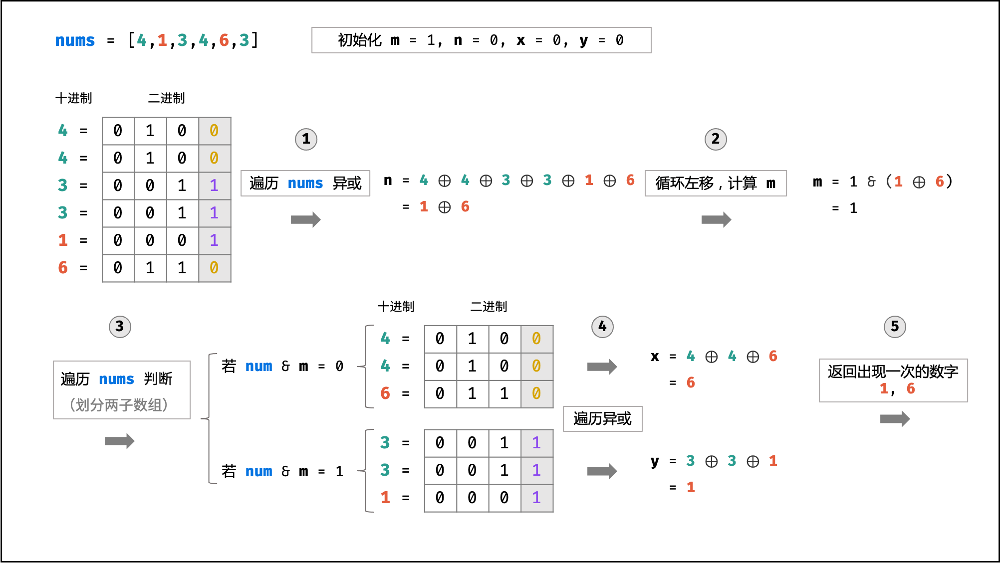

## Leetcode题库-秋招高频

### -----------数组Part-----------

### 1. 数组中的第K个最大元素（215-Medium）

**题目**：https://leetcode-cn.com/problems/kth-largest-element-in-an-array/

**方法**：快速排序/堆排序

（1）快速排序：可以优化一下，判断当前确定的节点下标是否等于nums.length - k，等于则找到；大于则向后找，小于则往前找。减少排序负载。

```js
var findKthLargest = function(nums, k) {
    if(!nums.length) return -1
    let key = nums.length - k
    let quickSort = function(arr, start, end) {
        if(start >= end) return
        let temp = arr[start]
        let i = start, j = end
        while(i<j) {
            while(i<j && temp <= arr[j]) j--
            arr[i] = arr[j]
            while(i<j && temp >= arr[i]) i++
            arr[j] = arr[i]
        }
        arr[i] = temp
        // 快排优化，判断当前确定的下标是否是要找的位置，如果是直接返回
        if(i === key)
            return 
        // 当前确定的下标大于要找的位置k，则向左找
        else if(i > key)
            quickSort(arr,start, i-1)
        // 当前确定的下标小于要找的位置k，则向右找
        else
            quickSort(arr,i+1, end)
    }
    quickSort(nums, 0, nums.length-1)
    return nums[key]
};
```

（2）堆排序的方法太长去看代码模板。

### 2. 删除有序数组中的重复项（26-Easy)

**题目**：https://leetcode.cn/problems/remove-duplicates-from-sorted-array/

**方法**：双指针，如果有重复的全部删除只保留一个

```js
// 双指针
var removeDuplicates = function(nums) {
    let left = 0,right = 0
    for(right = 1;right < nums.length;right++){
        // 右指针遇到新的不重复的数时，就放在左指针后面
        if(nums[left] !== nums[right]){
            nums[left + 1] = nums[right]
            left ++
        }
        // 遇到重复的数字就跳过，right指针继续向前
        continue
    }
    // left + 1即为去重后数组的长度
    return left + 1
};
```

### 3. 删除有序数组中的重复项 II（80-Medium）

**题目**：https://leetcode.cn/problems/remove-duplicates-from-sorted-array-ii/

**方法**：双指针，时间复杂度O(n)，空间复杂度O(1)，如果有三个重复的删除一个保留两个。

```js
var removeDuplicates = function(nums) {
    let n = nums.length
    if(n <= 2)
        return n
    // 左指针指向当前即将放置元素的位置，右指针向后遍历所有元素指向待检查元素
    let left = 2, right = 2
    while(right < n){
        if(nums[right] != nums[left - 2]){
            nums[left] = nums[right]
            left += 1
        }
        // 如果遇到不满足条件的重复元素，则left不动，right指针继续向后，寻找符合条件放入left
        right += 1
    }
    return left
};
```

### 4. 在排序数组中查找元素的第一个和最后一个位置（34-Medium）

**题目**：https://leetcode.cn/problems/remove-duplicates-from-sorted-array-ii/

**方法**：二分查找，题目要求时间复杂度O(log n)

​	其中所用的二分查找方法和剑指Offer在排序数组查找数字I的方法相同

```js
//  二分查找，时间复杂度O(logn)
var searchRange = function(nums, target) {
    // 查找target的右边界
    function findtarget(target){
        let low = 0, high = nums.length - 1
        while(low <= high){
            let mid = low + Math.floor((high - low) / 2)
            if(nums[mid] <= target)
                low = mid + 1
            else
                high = mid - 1
        }
        return low
    }
    // target - 1的右边界即为target的开始位置，target的右边界-1即为target的结束位置
    let startIndex = findtarget(target - 1)
    let rightIndex = findtarget(target) - 1
    // 如果target不存在则返回[-1,-1]
    if(startIndex == nums.length  || nums[startIndex] != target)
        return [-1,-1]
    // 存在则返回结果
    return [startIndex, rightIndex]
        
};
```

### 5. 合并两个有序数组（88-Easy）

**题目**：https://leetcode.cn/problems/merge-sorted-array/

**方法**：双指针遍历两个数组，寻找最小的放入结果数组中，再将结果数组内容放置nums1中（题目要求合并到nums1中）

```js
// 双指针，时间复杂度和空间复杂度都是O(m+n)
var merge = function(nums1, m, nums2, n) {
    let temp = []
    let p1 = 0, p2 = 0
    // 双指针遍历两个数组，每次取两个数字头部小数字比较，较小的放入结果数组中
    // 两个指针同时到达尾部才算结束
    while(p1 < m || p2 < n){
        // 如果p1===m 则说明nums1中的数据对比完了,直接将nums2的循环推入数组
        if(p1 === m)
            temp.push(nums2[p2++])
        // 如果p2===n 则说明nums2中的数据对比完了,直接将nums1的循环推入数组
        else if(p2 === n)
            temp.push(nums1[p1++])
        else if(nums1[p1] < nums2[p2])
            temp.push(nums1[p1++])
        else
            temp.push(nums2[p2++])
    }
    // 将结果数组的内容放到nums1中，因为它要求合并到nums1中
    for(let i = 0;i < m + n;i++){
        nums1[i] = temp[i]
    }
};
```


### 6. 有效的括号（20-Easy)

**题目**：https://leetcode-cn.com/problems/valid-parentheses/

**方法**：栈

```js
 // 用栈存储左括号，遇到右括号进行匹配
var isValid = function(s) {
    // 建立括号映射字典
    dict = {'(':')','{':'}','[':']'}
    // 设置一个栈
    let stack = []

    for(let c of s){
        // 遍历字符串中的字符，如果在dict的key里面，属于左括号，进栈
        if(c in dict)
            stack.push(c)
        // 不是左括号一定是右括号
        // 栈为空，没有左括号匹配，直接返回false
        // 栈非空：弹出栈顶元素的左括号去字典寻找，不匹配返回false，匹配就已经弹出
        else if(!stack.length || dict[stack.pop()]!=c)
            return false
    }

    // 最后看栈是否为空，空则表示有效，非空则表示无效
    return stack.length == 0

};
```

### -----------递归回溯-----------

### 1. 全排列（46-Medium）

**题目**：https://leetcode.cn/problems/permutations/

**方法**：递归+回溯，无重复数字的序列

```js
var permute = function(nums) {
    let res = []
    function backtrace(nums, path){
        // 当传入数组中可用的数已经用完时，将当前路径加入结果数组
        if(nums.length == 0){
            res.push(path)
            return
        }
        // 遍历传入的nums数组
        for(let i = 0;i < nums.length;i++){
            // 除去nums[i]以外剩余元素组成的数组，path加入当前遍历的数，递归继续进行排列
            backtrace(nums.slice(0,i).concat(nums.slice(i+1)), path.concat([nums[i]]))
        }       
    }
    // 递归起点
    backtrace(nums,[])
    return res
};
```

### 2. 全排列 II（47-Medium）

**题目**：https://leetcode.cn/problems/permutations/

**方法**：递归+回溯，Set去重，题目意思为nums是有重复数字的序列，返回的排列不能有重复的排列。

```js
var permuteUnique = function(nums) {
    let res = []
    function dfs(nums, path){
        if(nums.length == 0 ){
            res.push(path)
            return
        }
        // 利用Set记录该层已经遍历过的数字
        let seen = new Set()
        for(let i = 0;i < nums.length;i++){
            // 当前数字在set中已经存在则继续循环
            if(seen.has(nums[i]))
                continue
            // 没出现过则记录下来
            seen.add(nums[i])
            dfs(nums.slice(0,i).concat(nums.slice(i+1)), path.concat([nums[i]]))
        }
    }
    dfs(nums, [])
    return res
};
```

### 3. 岛屿数量（200-Medium）

**题目**：https://leetcode.cn/problems/number-of-islands/

**方法**：DFS深度优先搜索，遇到标注为'1'的就开始DFS它的上下左右，遍历过的'1'要标记成'2'避免重复遍历。

```js
var numIslands = function(grid) {
    let islandNum = 0
    for(let i = 0;i < grid.length;i++){
        for(let j = 0;j < grid[0].length;j++){
            // 遇到岛，开始深度优先搜索
            // 最终岛屿的数量就是深度优先搜索的次数
            if(grid[i][j] == '1'){
                infect(grid, i, j)
                islandNum ++
            }
        }  
    }
    return islandNum
    // 递归标注，将所有相连的1都标注成2避免重复计算
    function infect(grid, i, j){
        // 如果超过边界或者当前不是1，则返回
        if(i < 0 || j < 0 || i >= grid.length || j >= grid[0].length || grid[i][j] != '1')
            return 
        // 将1改成2
        grid[i][j] = '2'
        infect(grid, i + 1, j)
        infect(grid, i - 1, j)
        infect(grid, i, j + 1)
        infect(grid, i, j - 1)
    }
};
```

### 4. 岛屿的最大面积（695-Medium）

**题目：**https://leetcode.cn/problems/max-area-of-island/

**方法：**深度优先搜索，每块岛屿计算累计1的个数

```js
var maxAreaOfIsland = function(grid) {
    let area = 0
    for(let i = 0;i < grid.length;i++){
        for(let j = 0;j < grid[0].length;j++){
            if(grid[i][j] == '1'){
                // 求所有岛屿中的面积最大值
                area = Math.max(dfs(grid,i,j), area)
            }
        }
    }
    return area
    // 寻找连在一起的岛屿, 更新最大值
    function dfs(grid, i, j){
        if(i < 0 || i >= grid.length || j < 0 || j >= grid[0].length || grid[i][j] != '1')
            return 0
        // 标记访问过的岛屿, 不会重复访问
        grid[i][j] = '2'
        let count = 1
        count += dfs(grid, i + 1, j)
        count += dfs(grid, i - 1, j)
        count += dfs(grid, i, j + 1)
        count += dfs(grid, i, j - 1)
        return count
    }

};
```

### -----------动态规划-----------

### 1. 最长公共子序列（1143-Medium）

**题目**：https://leetcode.cn/problems/longest-common-subsequence/

**方法**：动态规划

```js
// 动态规划
// 时间复杂度和空间复杂度均为O(mn)
var longestCommonSubsequence = function(text1, text2) {
    let m = text1.length
    let n = text2.length
    
    // dp[i][j] 表示text1[0:i-1]和text2[0:j-1]的最长公共子序列，dp[0][0] = 0
    // 多声明一个长度便于i=0或者j=0时，空串和另一个字符串的匹配
    // 使用数组填充数组构建二维数组一个很简便的写法
    let dp = Array.from(Array(m+1), () => Array(n+1).fill(0));
    
    for(let i = 1;i < m + 1;i++){
        for(let j = 1;j < n + 1;j++){
            // 两个子字符串的最后一位相等，所以最长公共子序列又增加了 1
            if(text1[i - 1] == text2[j - 1]){
                dp[i][j] = dp[i-1][j-1] + 1
            }
            else{
                // # 两个子字符串的最后一位不相等，此时目前最长公共子序列长度为两个字符串其中之一去除当前不相等字符前面子串与另一字符串的匹配
                dp[i][j] = Math.max(dp[i-1][j], dp[i][j-1])
            }
        }
    }
    return dp[m][n]
};
```

### 2. 最长重复子数组（718-Medium）

**题目**：https://leetcode.cn/problems/maximum-length-of-repeated-subarray/

**方法**：动态规划，注意子数组要连续，子序列不用连续

```js
var findLength = function(nums1, nums2) {
    let m = nums1.length
    let n = nums2.length
    // dp[i][j]表示nums[0:i-1]和nums2[0:j-1]的最长重复子数组的长度
    let dp = Array.from(Array(m + 1), ()=> Array(n + 1).fill(0))
    // 初始化最大长度为0
    let res = 0
    for(let i = 1;i < m + 1;i++){
        for(let j = 1;j < n + 1;j++){
            // 当前数字相同，则最长重复子数组长度+1，实时记录长度
            if(nums1[i-1] == nums2[j-1]){
                dp[i][j] = dp[i-1][j-1] + 1
                res = Math.max(res, dp[i][j])
            }
            // 当前数字不同，子数组就断开了，所以dp[i][j]就为0。子序列则不一样
        }
    }
    return res
};
```

### 3. 最长递增子序列（300-Medium）

**题目**：https://leetcode.cn/problems/longest-increasing-subsequence/

**方法**：动态规划

```js
var lengthOfLIS = function(nums) {
    // 特殊情况：如果数组长度小于等于1的话，直接返回数组长度
    if(nums.length <= 1)
        return nums.length
    // dp[i]表示以nums[i]结尾的最长递增子序列的长度，初始化为1
    let dp = new Array(nums.length).fill(1)
    let res = 0
    for(let i = 1;i < nums.length;i++){
        for(let j = 0;j < i;j++){
            if(nums[j] < nums[i]){
                // dp[i]等于j从0到i-1各个位置的最长升序子序列 + 1 的最大值
                dp[i] = Math.max(dp[i], dp[j] + 1)
            }
        }
        // 实时记录更新最大长度
        res = Math.max(res, dp[i])
    }
    return res
};
```

### 4. 最长递增子序列的个数（673-Medium）

**题目**：https://leetcode.cn/problems/number-of-longest-increasing-subsequence/

**方法**：动态规划，增加计算个数的count

```js
var findNumberOfLIS = function(nums) {
    // 特判
    if(nums.length <= 1) return 1

    // dp[i]表示以nums[i]结尾的最长递增子序列长度
    // count[i]表示以nums[i]结尾的最长递增子序列个数
    let dp = new Array(nums.length).fill(1)
    let count = new Array(nums.length).fill(1)
    // 记录最长递增子序列的长度
    let maxLength = 0

    for(let i = 1;i < nums.length;i++){
        for(let j = 0;j < i;j++){
            if(nums[j] < nums[i]){
                // 找到一个更长的子序列
                if(dp[j] + 1 > dp[i]){
                    dp[i] = dp[j] + 1
                    count[i] = count[j]
                } 
                // 找到了两个相同长度的递增子序列
                else if (dp[j] + 1 == dp[i]){
                    count[i] += count[j]
                }
            }
        }
        maxLength = Math.max(maxLength, dp[i])
    }
    // 统计最长递增子序列共有几个
    let res = 0
    for(let i = 0;i < nums.length;i++){
        if(dp[i] == maxLength)
            res += count[i]
    }
    return res
};
```

### 5. 最长公共前缀（14-Easy)

**题目**：https://leetcode.cn/problems/longest-common-prefix/

**方法**：选取最短的作为最大公共前缀，依次和其他字符串按列比较字符是否相等，遇到不相等则更新截取更新最大公共前缀

```js
var longestCommonPrefix = function(strs) {
    // 将字符串数组按照长度从小到大排序
    strs.sort((a,b)=>{return a.length - b.length})
    // 将长度最小的字符串作为目前的最大公共前缀
    let min_str = strs[0]

    // 遍历后面的字符串，与min_str比较获取它们的最大公共前缀赋给min_str
    for(let i = 1;i < strs.length;i++){
        for(let j = 0;j < min_str.length;j++){
            // 当前列字符不相等，在min_str上截取新的最大公共前缀
            if(strs[i][j] != min_str[j]){
                // 如果是第一列，说明它们一定是没有公共前缀
                if(j == 0)  return ''
                min_str = min_str.substring(0,j)
                
            }
        }
    }
    return min_str
};
```

### 6. 最长回文子串(5-Medium)

**题目**：https://leetcode.cn/problems/longest-palindromic-substring/

**方法**：动态规划，`dp[i][j]`表示子串i～j是否是回文子串，回文子串必须满足s[i]，s[j]相等，并且向内扩展一个字符也相等，即`dp[i+1][j-1]`也是回文子串。如果找到回文子串，则更新最大长度

```js
// 动态规划
var longestPalindrome = function(s) {
    let n = s.length;
    let res = '';
    // dp[i][j]表示子串i～j是否是回文子串
    let dp = Array.from(new Array(n),()=>new Array(n).fill(false))
    for(let i = n - 1;i >= 0; i--){
        for(let j = i;j < n;j++){
            // 回文子串必须满足s[i]，s[j]相等，并且向内扩展一个字符也相等，即dp[i+1][j-1]也是回文子串
            dp[i][j] = s[i] == s[j] && (j - i < 2 || dp[i+1][j-1])
            // 当前回文子串比之前的大，更新最长回文子串
            if(dp[i][j] && j - i + 1 > res.length){
                res = s.substring(i, j + 1)
            }
        }
    }
    return res
};
```

### 7. 打家劫舍（198-Medium）

**题目**：https://leetcode.cn/problems/house-robber/

**方法**：动态规划，对于第i家有抢和不抢两种情况，抢则是i-2加上当前家，不抢则是i-1

```js
//  动态规划
var rob = function(nums) {
    let n = nums.length
    // dp[i]表示偷到第i家可以获得最高金额
    let dp = new Array(n)
    // 初始化，第一家直接偷是最高的
    dp[0] = nums[0]
    // 第二家取决于只偷第一家最高还是只偷第二家最高
    dp[1] = Math.max(nums[0],nums[1])
    for(let i = 2;i < nums.length;i++){
        // 第i家 = 偷i-2家+当前第i家 和 偷i-1家的最大金额
        dp[i] = Math.max(dp[i-2] + nums[i], dp[i-1])
    }
    return dp[n-1]
};
```

### 8. 打家劫舍II（213-Medium）

**题目**：https://leetcode.cn/problems/house-robber-ii/

**方法**：和I的不同在于，首尾是相连的，意味着第一家和最后一家不能同时抢，环拆成两个队列，还是I的函数，第一家到倒数第二家和第二家到最后一家，看哪个金额多。

```js
// 动态规划，和I不同的就是首尾不能同时偷
// 核心：将环拆成两个队列，[0,n-1) and [1,n)取最高金额
var rob = function(nums) {
    let n = nums.length
    if(n <= 1)
        return n == 0? 0:nums[0]
    return Math.max(robI(nums.slice(0, n-1)), robI(nums.slice(1, n)))
    // 这是打家劫舍I
    function robI(nums){
        let n = nums.length
        let dp = new Array(n)
        dp[0] = nums[0]
        dp[1] = Math.max(nums[0], nums[1])
        for(let i = 2;i < nums.length;i++){
            dp[i] = Math.max(dp[i-2] + nums[i],dp[i-1])
        }
        return dp[n-1]
    }

};
```

### 9. 打家劫舍 III（337-Medium）

**题目**：https://leetcode.cn/problems/house-robber-iii/

**方法**：这个与前两个不太相同的是，dp不是在数组上是在树上，需要递归判断每个结点抢或者不抢，再看左右子树的状态。

```js
//  树形dp，每个结点分为抢或者不抢两种情况，抢则左右子树不能抢
var rob = function(root) {
    // 以root为根节点的树中，返回抢劫root节点与不抢劫root节点可获得的最大值
    function _rob(root){
        //  两个0分别表示抢/不抢该节点可获得的最大值
        if(!root) return [0,0]
        // left和right均为二维数组，第一维表示偷该节点获取的金额，第二维表示不偷该节点获取的金额
        // 递归对于以root.left为根节点的树计算抢劫根节点和不抢劫根节点可获得的最大金额，right同理
        let left = _rob(root.left)
        let right = _rob(root.right)
        // 抢该节点，那左右子树都不能抢，加上左右子树都不抢的金额
        let v1 = root.val + left[1] + right[1]
        // 不抢该节点，那左右子树可以抢，选取左右子树各自的最大金额
        let v2 = Math.max(left[0],left[1]) + Math.max(right[0],right[1])
        return [v1,v2]
    }
    // 选取抢或者不抢两种情况的最大值
    return Math.max(..._rob(root))
};
```

### 10. 爬楼梯（70-Easy）

**题目**：https://leetcode.cn/problems/climbing-stairs/

**方法**：每次你可以爬 `1` 或 `2` 个台阶，可以有递归和动态规划两种方法，递归会超时

```js
// 动态规划
var climbStairs = function(n) {
    let dp = new Array(n+1)
    dp[0] = 0
    dp[1] = 1
    dp[2] = 2
    for(let i =3 ;i < n + 1;i++){
        dp[i] = dp[i-1] + dp[i-2]
    }
    return dp[n]
};
// 递归
var climbStairs = function(n) {
    if(n == 0)
        return 0
    if(n == 1)
        return 1
    if(n == 2)
        return 2
    return climbStairs(n-1) + climbStairs(n-2)
};
```

### 11. 最小路径和(64-Medium)

**题目**：https://leetcode.cn/problems/minimum-path-sum/

**方法**：找出一条从左上角到右下角的路径，使得路径上的数字总和为最小。采用动态规划的方法，状态转移方程为左边和上边来的最小的加上当前位置，注意单独判断左上角起点和第一行第一列。

```js
// 动态规划，不需要重新开设数组，可以直接修改表格里面的数据记录路径之和
var minPathSum = function(grid) {
    let m = grid.length
    let n = grid[0].length
    for(let i = 0;i < m;i++){
        for(let j = 0;j < n;j++){
            // 左上角和第一行第一列单独判断
            if(i == 0 && j == 0) continue
            else if(i == 0) grid[i][j] = grid[i][j - 1] + grid[i][j]
            else if(j == 0) grid[i][j] = grid[i - 1][j] + grid[i][j] 
            // 其它位置根据动态路径转移方程更新路径和，来自左边或者上面的最小值加上当前的值
            else grid[i][j] = Math.min(grid[i][j-1], grid[i-1][j]) + grid[i][j]
        }
    }
    return grid[m-1][n-1]

};
```


### -----------滑动窗口-----------

### 1. 无重复字符的最长子串（3-Medium）

**题目**：https://leetcode.cn/problems/longest-substring-without-repeating-characters/

**方法**：设置左右两个指针，右指针向后走，遇见非重复元素加入维护set，重复元素则窗口右移删除左边元素，直到将重复元素删除。记录当前非重复子串的长度的最大值。

```js
var lengthOfLongestSubstring = function(s) {
    let left = 0, right = 0
    let res = 0
    let temp = new Set()
    let N = s.length
    while(right < N){
        // 出现重复元素窗口右移，删除左边元素直到将重复元素删除
        while(temp.has(s[right])){
            temp.delete(s[left])
            left += 1
        }
        // 非重复元素添加且记录长度
        temp.add(s[right])
        res = Math.max(res, right - left + 1)
        right += 1
    }
    return res
};
```


### -----------贪心Part-----------

### 0. 什么时候用贪心？
**原理**：
当发现一个问题的解决只需要考虑最优子结构的问题即可，即每一步最优，不需要考虑整体
**参考**：https://blog.csdn.net/TuttuYYDS/article/details/124636914
**题型**：
**1、求最优解：最大，最小，最多，做少、最高级**

**2、最优解有约束的条件**

### 1. 分糖果（575-Easy）

**题目**：https://leetcode.cn/problems/distribute-candies/

**方法**：贪心，在保证吃的糖不超过n/2的前提下尽可能吃多的种类，假设糖的种类m，最多吃n/2，如果m<n/2，那么在给定个数下吃最多种类即为m，如果n/2 < m，那么只能吃n/2种糖。

```js
// 贪心
// 糖的种类m，最多吃n/2，如果m<n/2，那么在给定个数下吃最多种类即为m
// 如果n/2 < m，那么只能吃n/2种糖
// 答案就是m和n/2的最小值
var distributeCandies = function(candyType) {
    // 糖果种类数为set.size
    let set = new Set(candyType)
    return Math.min(set.size, candyType.length / 2)
};
```

### 2. 跳跃游戏（55-Medium）

**题目**：https://leetcode.cn/problems/jump-game/

**方法**：贪心，转换成计算跳跃覆盖范围，每次移动计算新的覆盖范围，判断最后能否覆盖终点下标

```js
// 贪心转化：跳跃覆盖范围究竟可不可以覆盖到终点
// 每次移动取最大跳跃步数（得到最大的覆盖范围），每移动一个单位，就更新最大覆盖范围。
var canJump = function(nums) {
    // 当前覆盖范围
    let cover = 0
    // i在cover范围内移动
    for(let i = 0;i <= cover;i++){
        // 每移动一个元素，cover得到新的覆盖范围
        cover = Math.max(cover,nums[i] + i)
        // cover大于等于了终点下标，直接return true
        if(cover >= nums.length - 1)
            return true
    }
    return false

};
```

### 3. 跳跃游戏II（45-Medium）

**题目**：https://leetcode.cn/problems/jump-game-ii/

**方法**：贪心，以最小的步数增加最大的覆盖范围。计算当前覆盖的最远距离和下一步覆盖的最远距离

```js
 // 贪心，以最小的步数增加最大的覆盖范围，直到覆盖范围覆盖了终点
var jump = function(nums) {
    let curDistace = 0 // 当前覆盖的最远距离下标
    let nextDistance = 0 // 下一步覆盖的最远距离下标
    let step = 0
    // 关键，让移动下标只移动到nums.length - 2，
    // 如果移动下标不等于当前覆盖的最远距离下标内，说明当前覆盖最远距离可以直接达到终点
    // 如果移动下标等于当前覆盖的最远距离下标内，则需要再走一步
    for(let i = 0;i <nums.length - 1;i++){
        // 更新下一步覆盖的最远距离下标
        nextDistance = Math.max(nextDistance, nums[i] + i)
        if(i == curDistace){
            curDistace = nextDistance
            step ++
        }
    }
    return step

};
```
### 4. 分割平衡字符串（1221-Easy）

**题目**：https://leetcode.cn/problems/split-a-string-in-balanced-strings/

**方法**：贪心，分割成尽可能多的平衡字符串，只要平衡就贪心（即局部最优的思想）

```js
//假设 ‘R’ == 1, ‘L’ == -1 .只要累加等于 0 就算分割(贪心)一次
var jump = function(nums) {
    int cnt = 0;
    int balance = 0;
    for(int i = 0; i < s.length(); i++){
        if(s.charAt(i) == 'L')
            balance--;
        if(s.charAt(i) == 'R')
            balance++;
        if(balance == 0)
            cnt++;
    }
    return cnt;
};
```

### 5. 最多删除一个字符得到回文（019-Easy）

**题目**：https://leetcode.cn/problems/RQku0D/

**方法**：贪心，满足找最优解(最多一个)，满足有约束条件(回文、只删除一个)，考虑从局部出发判断删除某个元素后是否满足回文

```js
//贪心+双指针
var validPalindrome = function(s) {
    let left = 0, right = s.length-1;
    while(left < right){
      //不满足回文，需要删除一个元素
      //有两种情况，要么删除left要么删除right
      if(s[left] != s[right]){
        return valid(left+1, right) || valid(left, right-1)
      }
      left++;
      right--;
    }
    function valid(left, right){
      while(left < right){
        if(s[left] != s[right]){
          return false;
        }
        left++;
        right--;
      }
      return true;
    }
    return true;
};
};
```

### -----------背包Part-----------

### 1. 目标和（494-Medium）

**题目：**https://leetcode.cn/problems/target-sum/

**方法：**0-1背包问题，加法和 - （减法和） = target，加法和 - （sum - 加法和）= target，加法和（halfSum） = (sum + target) / 2，可以转化成找用nums里的元素组合成加法和(halfSum)的不同组合个数。转化为背包问题就是找到装满容量为加法和(halfSum)背包的方法数。

```js
var findTargetSumWays = function(nums, target) {
    let sum = nums.reduce((a,b) => a + b)
    // nums元素之和小于target的绝对值，永远无法组合成target
    if(sum < Math.abs(target))
        return 0
    // (sum + target) / 2不为整数，也无法组合
    if((sum + target) % 2 === 1)
        return 0

    let halfSum = (sum + target) / 2
    // dp[i]表示装满容量为i的背包的方法数
    let dp = new Array(halfSum + 1).fill(0)
    // 背包为空时默认一种方法
    dp[0] = 1
    for(let i = 0;i < nums.length;i++){
        for(let j = halfSum;j >= nums[i];j--){
            dp[j] += dp[j - nums[i]]
        }
    }
    return dp[halfSum]
};
```


### -----------链表Part-----------

### 1. 环形链表（141-Easy）

**题目：**https://leetcode.cn/problems/linked-list-cycle/ 

**方法：**判断是否有环。快慢指针，快指针走两步慢指针走一步，相遇即为存在环

```js
// 快慢指针
var hasCycle = function(head) {
    let slow = head
    let fast = head
    while(fast && fast.next){
        slow = slow.next
        fast = fast.next.next
        // 快慢指针相遇表示有环
        if(slow == fast){
            return true
        }
    }
    return false
};
```

### 2. 环形链表 II（142-Medium）

**题目：**https://leetcode.cn/problems/linked-list-cycle-ii/

**方法：**返回链表开始入环的第一个节点。快慢指针，快指针走两步慢指针走一步，相遇即为存在环

```js
// 快慢指针：相遇判有环，置头再相遇得起点
var detectCycle = function(head) {
    let slow = head
    let fast = head
    while(true){
        if(fast == null || fast.next == null){
            return null
        }
        slow = slow.next
        fast = fast.next.next
        // 快慢指针相遇证明有环，跳出循环找起点
        if(slow == fast)
            break
    }
    // 将fast指向head，重新和slow一步一步向前走直到相遇即为起点
    fast = head
    while(fast != slow){
        fast = fast.next
        slow = slow.next
    }
    return slow


```

### 3. 相交链表（160-Easy）

**题目：**https://leetcode.cn/problems/intersection-of-two-linked-lists/

**方法：**求两个相交链表的交点，定义两个指针向后遍历走，走到终点后再分别指向对方的头结点继续走，直到相遇则当前节点即为交点

```js
// 定义两指针走到终点后再分别指向对方的头结点，两个指针走过相同的距离，相遇则为交点 
var getIntersectionNode = function(headA, headB) {
    if(headA == null || headB == null) return null
    let pa = headA
    let pb = headB
    while(pa != pb){
        // 走到终点后指向另一链表的表头
        pa = pa == null ? headB : pa.next
        pb = pb == null ? headA : pb.next
    }
    return pa
};
```

### 4. 反转链表（206-Easy）

**题目**：https://leetcode.cn/problems/reverse-linked-list/

**方法**：迭代法和递归法

```js
// 迭代法
// 时间复杂度O(n)，空间复杂度O(1)
var reverseList = function(head) {
    // prev表示前驱结点，curv表示当前结点
    let prev = null
    let curv = head
    while(curv) {
        // 存储当前结点的后驱结点（关键，因为curv要向后移动）
        let next = curv.next
        // 当前结点的指针指向前面的结点
        curv.next = prev
        // 前驱结点后移
        prev = curv
        // 当前结点后移
        curv = next
    }
    return prev
};
// 递归法
// 时间复杂度O(n)，空间复杂度O(n)
var reverseList = function(head) {
    // 一直递归到链表的最后一个结点，该结点就是反转后的头结点
    if(head == null || head.next == null)
        return head
    let node = reverseList(head.next)
    // 每次函数在返回的过程中，让当前结点的下一个结点的 next指针指向当前节点
    head.next.next = head
    // 同时让当前结点的 next 指针指向 null
    head.next = null
    return node
};
```

### 5. 删除排序链表中的重复元素（83-Easy）

**题目**：https://leetcode.cn/problems/remove-duplicates-from-sorted-list/

**方法**：删除所有重复的元素，使每个元素只出现一次。一次遍历迭代法

```js
// 一次遍历，重复元素是相邻的
// 时间复杂度：O(n)，空间复杂度：O(1)
var deleteDuplicates = function(head) {
    let cur = head
    // 当前结点和下一结点存在时
    while(cur && cur.next){
        // 判断是否重复，重复的话删除cur.next
        if(cur.val == cur.next.val){
            cur.next = cur.next.next
        }
        else{
            cur = cur.next
        }
    }
    return head
};
```

### 6. 删除排序链表中的重复元素 II（82-Medium）

**题目**：https://leetcode.cn/problems/remove-duplicates-from-sorted-list-ii/

**方法**：删除原始链表中所有重复数字的节点，只留下不同的数字。一次遍历迭代法

```js
// 一次遍历，重复的元素在链表中出现的位置是连续的
// 时间复杂度：O(n)，空间复杂度：O(1)
var deleteDuplicates = function(head) {
    // 设置哑结点，指向head，便于处理当从头结点就开始出现重复元素的情况
    let dummpy = new ListNode(0, head)
    let cur = dummpy
    // 从第一个结点开始遍历，当连续两个结点存在时判断是否值相同
    while(cur.next && cur.next.next) {
        if(cur.next.val == cur.next.next.val){
            // 记录下重复的值
            let temp = cur.next.val
            // 从出现重复值的位置开始遍历，后续等于temp需要删除
            while(cur.next && cur.next.val == temp){
                cur.next = cur.next.next
            } 
        }
        else{
            cur = cur.next
        }
    }
    return dummpy.next
};
```

### -----------哈希表Part-----------

### 1. 砖墙（554-Meidum）

**题目：**https://leetcode.cn/problems/brick-wall/

**详情**：给出二维数组一面墙砖块的分布情况，求画一根垂直线穿过最少的砖块，返回穿过的砖块数量。

**方法：**穿过最少的砖块数量也就是穿过最多的缝隙，对于每一行砖的宽度之和是相同的，说明墙面是被铺满的。可以根据砖块宽度的前缀和计算出每个缝隙的位置，再计算所有行哪个缝隙位置出现的次数最多，则穿过那个位置的竖线经过的砖块也是最少的。所以砖块的数量 = 墙的层数 - 最多出现的缝隙位置次数

```js
// 墙的层数 - 最多出现的缝隙位置次数 = 穿过的最少的砖块，（不包括最后边界）
var leastBricks = function(wall) {
    // 获取墙的层数
    let wallHeight = wall.length
    // 设置哈希表
    let map = new Map()
    for(let i = 0;i < wall.length;i++){
        // 前缀和求每一行墙缝隙出现的位置，用哈希表存储缝隙位置出现的次数
        // j < wall[i].length - 1不包括最后墙的右边界不用计算
        let sum = 0
        for(let j = 0;j < wall[i].length - 1;j++){
            sum += wall[i][j]
            map.set(sum, map.has(sum) ? map.get(sum) + 1 : 1)
        }
    }
    // 计算哈希表中出现最多的缝隙位置出现的次数，穿过最少的砖块也就是穿过最多的缝隙
    let maxGapCount = 0
    for(let val of map.values()){
        maxGapCount = Math.max(val, maxGapCount)
    }
    return wallHeight - maxGapCount

};
```

### 2. 和为K的子数组(560-Medium)

**题目：**https://leetcode.cn/problems/subarray-sum-equals-k/

**详情**：给你一个整数数组 nums 和一个整数 k ，请你统计并返回 该数组中和为 k 的连续子数组的个数。

**方法：**哈希表存储前缀和和前缀和出现的次数，寻找sum-k是否存在，存在的话累加出现的次数即为结果

```js
//  有点像两数之和
var subarraySum = function(nums, k) {
    // 哈希表，键为前缀和，值为前缀和出现的次数
    let map = new Map()
    // 可能当前的前缀和恰好等于k，此时两者相减为0，这也算是满足题目条件的一种情况
    map.set(0,1)
    let sum = 0
    let res = 0
    for(let i = 0;i < nums.length;i++){
        sum += nums[i]
        // 寻找map中是否已经存在sum-k，有的话将对应次数累加到res里面
        if(map.has(sum - k))
            res += map.get(sum - k)
        // 对于当前sum如果已存在与map中则其对应值+1，不存在则添加新项，初始值为1。
        map.set(sum, map.has(sum) ? map.get(sum) + 1: 1)   
    }
    return res
};
```


## LeetCode题库-其他

### 两数之和（1-Easy）

**题目：**https://leetcode.cn/problems/two-sum/comments/

**方法：**哈希表

```js
// 普通哈希表法
var twoSum = function(nums, target) {
    let dict = {}
    for(let i = 0;i < nums.length;i++){
        if((target - nums[i]) in dict){
            return [dict[target - nums[i]], i]
        }
        dict[nums[i]] = i
    }
    return []
};
//  map哈希表法
var twoSum = function(nums, target) {
    let map = new Map()
    for(let i = 0;i < nums.length;i++){
        if(map.has(target - nums[i]))
            return [map.get(target - nums[i]), i]
        map.set(nums[i],i)
    }
    return []
};
```

### 回文数（09-Easy）

**题目**：https://leetcode-cn.com/problems/palindrome-number/

**方法**：字符列表翻转/数学解法重构数字/**数学解法对折比较**（不使用额外空间）

（1）字符列表翻转：数字转字符列表翻转再比较，注意不要漏string的split,join

```js
var isPalindrome = function(x) {
    //条件判断，小于0一定不是回文数
 	if(x<0)
     	return false
    return String(x) == String(x).split('').reverse().join('') ? true: false
}
```

（2）数学解法重构数字：从最低位到最高位重构新的数目res与x作比较,要注意js的/是有小数的，需要用Math.floor去取整

```js
var isPalindrome = function(x){
    let res = 0
    let cup = x
    while(cup > 0){
        res = res*10 + cup%10 //res从最低位开始累加
        cup = Math.floor(cup /10) //加一个cup就去掉一个最低位
    }
    return res == x
}
```

（3）数学解法对折比较：不使用额外的空间，比较最高位和最低位是否相同，如果相同就同时去掉最高位最低位，再判断。

```js
var isPalindrome = function(x){
    //先找x一共是几位数,比如1221，那div就是1000四位数
    let div = 1
    while(Math.floor(x/div) >= 10){ //因为本来div=1就代表至少是个位数，所以这里从大于10开始判断
        div *= 10
    }
    while(x > 0){
        let left = Math.floor(x/div) //取最高位, 注意这里不是用%，是要用除才能得到最高位
        let right = x%10 //取最低位
        if(left != right)
            return false
        //同时去掉最高位和最低位
        x = Math.floor(Math.floor(x%div)/10)
        //因为去掉最高位和最低位后相当于少了两位数，所以div要除以100
        div = Math.floor(div/100)
    }
    return true
}
```

### 计数质数（204-Medium）

**题目**：https://leetcode.cn/problems/count-primes/

**方法**：埃氏筛，如果 x 是质数，那么大于 x 的 x 的倍数 2x，3x… 一定不是质数。将质数所有的倍数标记为非质数，运行结束的时候就可以知道质数的个数

```js
 // 埃氏筛
var countPrimes = function(n) {
    // 设置一个数组，初始化为true
    let isPrime = new Array(n).fill(true)
    let res = 0
    for(let i = 2;i < n;i++){
        // 从2开始，是true表示是质数结果+1
        if (isPrime[i])
            res += 1
            // 将该质数的倍数设置为false非质数，从i*i开始，因为小于i的都在前面筛过了
            for(let j = i * i;j < n;j += i){
                isPrime[j] = false
            }
    }
    return res
};
```

### 乘积最大子数组（152-Medium）

**题目**：https://leetcode.cn/problems/maximum-product-subarray/

**方法**：使用两个变量来维护nums[i-1]的最大、最小乘积，维护最小是因为可能有负数的存在。

```js
var maxProduct = function(nums) {
    // 使用两个变量来维护上一个数的最大、最小乘积
    // 要记录最小是因为有负数的存在
    let res = -Infinity, temp_max = 1, temp_min = 1
    for(let i = 0;i < nums.length;i++){
        // 如果当前数是负数，那么相乘之后之前最小会变最大，最大会变最小
        if(nums[i] < 0){
            [temp_max, temp_min] = [temp_min, temp_max]
        }
        temp_min = Math.min(temp_min * nums[i], nums[i])
        temp_max = Math.max(temp_max * nums[i], nums[i])
        res = Math.max(res, temp_max)
    }
    return res
};
```

### 同构字符串（205-Easy）

**题目**：https://leetcode.cn/problems/isomorphic-strings/

**方法**：利用字典构造s和t的互相映射，发现对应不上就返回 false

```js
// 利用字典构造s和t的互相映射，发现对应不上就返回 false
var isIsomorphic = function(s, t) {
    let n = s.length
    let st = {}, ts = {}
    for(let i = 0;i < n;i++){
        // 判断s到t的映射
        if(!st[s[i]]) st[s[i]] = t[i]   // 如果没有s中的字符，就加入作为键，t中对应的字符作为值
        else if(st[s[i]] != t[i]) return false  // 如果有该字符，判断其值是否为t对应的字符
        // 判断t到s的映射
        if(!ts[t[i]]) ts[t[i]] = s[i]
        else if(ts[t[i]] != s[i]) return false
    }
    return true
};
```

### 子数组最大平均数I

**题目**：https://leetcode.cn/problems/maximum-average-subarray-i/

**方法**：可以直接划，边划边找满足长度为k的，就计一次和的最大值。也可以先取前k个计算出一个值，后面从第k个开始到后面不断的加入新的删除旧的，更新最大的和值，最后结果取平均数。

```js
// 直接划
var findMaxAverage = function (nums, k) {
    let left = 0, right = 0
    let maxSum = 0
    let res = -Infinity
    while(right < nums.length){
        maxSum += nums[right]
        while(right - left + 1 > k){
            maxSum -= nums[left]
            left += 1
        }
        // 满足长度为k的
        if(right - left + 1 == k)
            res = Math.max(res, maxSum)
        right += 1
    }
    return res / k
};


// 先取前k个的和，后面窗口划动加上新的减去旧的，实时记录最大值
var findMaxAverage = function (nums, k) {
    let n = nums.length
    let maxSum = 0
    for(let i = 0;i < k;i++) {
        maxSum += nums[i]
    }
    let res = maxSum //先获取第一个连续k个值的和
    for(let i = k;i < n;i++) {
        maxSum = maxSum +  nums[i] - nums[i-k]
        res = Math.max(res,maxSum)
    }
    return res/k
};
```

### 对角线遍历（498-Medium）

**题目**：https://leetcode.cn/problems/diagonal-traverse/

**方法**：将对角线元素存储到字典中再按题意顺序输出

```js
// 两步走战略
// 寻找对角线上元素i和j组合的唯一值作为键，将对角线上的数据存储为该键的值
// 按照题目的输出方向来输出
var findDiagonalOrder = function(mat) {
    // 收集/方向上的对角线，值数组存储时按照右上到左下的顺序
    // 根据矩阵特点，对每一条对角线来说，i+j的值是唯一的
    var map = {}
    for(let i = 0;i < mat.length;i++){
        for(let j = 0;j < mat[0].length;j++){
            if(!map[i+j]) map[i+j] = []
            map[i+j].push(mat[i][j])
        }
    }
    // 按照要求的方向输出
    let count = 1 // 初始为奇数对角线
    let res = []
    for(let key in map){
        // 奇数对角线，输出顺序应该为左下到右上，值倒序输出
        if(count & 1){
            for(let j = map[key].length - 1;j >= 0;j--)
                res.push(map[key][j])
        }
        // 偶数对角线，输出顺序应该为右上到左下，值顺序输出
        else{
            for(let j = 0;j < map[key].length;j++)
                res.push(map[key][j])
        }
        count++
    }
    return res
};
```

### 对角线遍历II（1424-Medium）

**题目**：https://leetcode.cn/problems/diagonal-traverse-ii/

**方法**：将对角线元素存储到字典中再按题意顺序输出

```js
var findDiagonalOrder = function(nums) {
    // 收集/方向的对角线
    // i+j作为键，对角线上的数字作为值数组，方向按照右上到左下的顺序存储的
    var map = {}
    for(let i = 0;i < nums.length;i++){
        for(let j = 0;j < nums[i].length;j++){
            if(!map[i+j]) map[i+j] = []
            map[i+j].push(nums[i][j])
        }
    }

    // 按照题意顺序输出，键会自动排序01234，也就是我们要输出的顺序，值数组要逆序输出
    let res = []
    for(let key in map){
        for(let j = map[key].length - 1;j >= 0;j--){
            res.push(map[key][j])
        }
    }
    return res
};
```

### 行星碰撞（735-Medium）

**题目**：https://leetcode.cn/problems/asteroid-collision/

**方法**：用栈模拟发生碰撞的过程

```js
var asteroidCollision = function(asteroids) {
    let stack = []
    for(let item of asteroids){
        // 当栈不存在或者遇到向右走的行星时，直接加入栈中
        if(stack.length === 0 || item > 0){
            stack.push(item)
        }else {
            // 判断是否需要添加当前行星到栈顶
            let remain = true
            while(stack.length !== 0){
                let temp = stack[stack.length - 1]
                // 栈最后一位向左的，直接结束循环
                if(temp < 0) break
                // 栈最后一位和该行星一样大，两个一起爆炸，出栈结束循环
                else if(temp == Math.abs(item)){
                    stack.pop()
                    remain = false
                    break
                }
                // 栈最后一位比该行星一样大，小的爆炸大的保留，不需要操作，当前行星不需要保留。
                else if(temp > Math.abs(item)){
                    remain = false
                    break
                // 栈最后一位比该行星一样小，出栈，继续循环
                }else
                    stack.pop()
            }
            if(remain == true)
                stack.push(item)
        }
    }
    return stack
};
```

### 加油站（134-Medium）

**题目**：https://leetcode.cn/problems/gas-station/

**方法**：满足两个条件：所有站里的油总量要`>=`车子的总耗油量；车从`i`站能开到`i+1`

​	从第一个位置开始，如果中途断了，那么刚刚走过的路，也是在此地就中断的。因此我们只需要在断点开始（作为起始点），如果能走到终点，就能到达所有的地方。

```js
var canCompleteCircuit = function(gas, cost) {
    let gasCode = 0
    let costCode = 0
    for(let i = 0;i < gas.length;i++){
        gasCode += gas[i]
    }
    for(let i = 0;i < cost.length;i++){
        costCode += cost[i]
    }
    // 总的汽油量如果小于总路程，肯定开不到终点
    if(gasCode < costCode)
        return -1
    let currentGas = 0
    let start = 0
    // 从第一个位置开始，如果中途断了，那么刚刚走过的路，也是在此地就中断的
    // 因此我们只需要在断点开始（作为起始点），如果能走到终点，就能到达所有的地方
    for(let i = 0;i < gas.length;i++){
        currentGas = currentGas - cost[i] + gas[i]
        if(currentGas < 0){
            currentGas = 0
            start = i + 1
        }       
    }
    return start
};
```

### 合并区间（56-Medium）

**题目**：https://leetcode.cn/problems/merge-intervals/

**方法**：先排序，再比较

```js
var merge = function(intervals) {
    // 先对每个区间左端点做升序排序
    intervals.sort((a,b)=>a[0] - b[0])
   
    const res = [intervals[0]]
    for(let i = 0;i < intervals.length;i++){
        // 如果待合并左端点大于已合并区间右端点，无重叠，放入结果数组
        if(intervals[i][0] > res[res.length - 1][1])
            res.push(intervals[i])
        // 发生区间重叠，取最大的右边界，将待合并区间右端点更新为已合并与待合并右端点的最大值
        else{
            res[res.length-1][1] = Math.max(intervals[i][1], res[res.length - 1][1])
        }
    }
    return res
};
```

## ES6语法

#### **1. 变量**

**变量声明**

​	var全局变量，let局部变量，for循环推荐用let定义i变量，用var的话变量会一直存在。**变量提升**：根据《ES6标准入门》书中的描述，var命令会发生“变量提升”现象，即变量在声明之前使用，值为undefined；为了纠正这种现象，let命令改变了语法行为，它所声明的变量一定要在声明后使用，否则就报错。

**变量交换**

​	ES6的解构赋值方法:[x, y] = [y, x]

#### 2. 数组

**数组遍历**

​	(...arr)

**创建全0数组**

​	var arr = new Array(10).fill(0);

**判断元素是否在数组内**

​	includes方法

```js
let arr = [1,2,3];
arr.includes(1) // true
arr.includes(5) //false
```

**求数组的交集、并集、补集、差集**

```js
//数组是简单数字或者字符串的交集、并集、补集、差集  es6
let arr1=[1,2,3,4,5],arr2=[4,5,6,7,8];
let set1=new Set(arr1),set2=new Set(arr2);

//交集
let intersection=arr1.filter(item=>set2.has(item));
console.log("交集",intersection);

//并集
let union=Array.from(new Set([...arr1,...arr2]));;
console.log("并集", union);

//补集 两个数组各自没有的集合
let complement=[...arr1.filter(item=>set2.has(item)==false),...arr2.filter(item=>set1.has(item)==false)];
console.log("补集", complement);

//差集 数组arr1相对于arr2所没有的
let diff=arr1.filter(item=>set2.has(item)==false);
console.log("差集",diff);
```

**数组查找是否符合条件**

​	arr.every()：在数组中查找是否有符合条件的元素，只要有一个不满足则直接返回false，否则返回true。只要找到一个不符合条件的元素后面的循环就停止了。**如果arr为空数组直接返回true**。

```js
const arr = [10, 2, 30, 100, 50]
// 参数：item数组中的元素，index元素下标，arr数组本身
const result = arr.every(function(item，index，arr) {
	return item < 200
})
result  // true
```

**根据某些条件创建新数组**

​	arr.map()：创建一个新数组，其结果是该数组中的每个元素都调用一个提供的函数后返回的结果。

```js
arr = [1,2,3,4,5]
var newArr = arr.map((item, index, arr) => {
    return item * 2;
})
console.log(newArr)
console.log(arr)
// newArr [2, 4, 6 ,8 ,10]
// arr [1, 2, 3, 4, 5]
```

#### 3. Map()

​	Map 结构提供了“值—值”的对应，是一种更完善的 Hash 结构实现。Map的遍历顺序就是插入顺序。

​	set、get、has

统计sum出现的次数

```js
map.set(sum, map.has(sum) ? map.get(sum) + 1 : 1)
```

获取map里面所有值的最大值

```js
let maxGapCount = 0
for(let val of map.values()){
    maxGapCount = Math.max(val, maxGapCount)
}
```


#### 4. Set()

判断一个数是否在set中

​	var set = new Set()

​	if(set.has(num)) // true表示在，false表示不在

#### 5. 函数

**函数声明**

```js
// ES5 普通函数
void func_name = function(canshu){}
const func_name = function(canshu){}
// 箭头函数
const func_name = canshu1 => {}
const func_name = (canshu1,canshu2) => {}
```

#### 6. 快速求数组内元素之和

`const sum = nums.reduce((a, b) => a + b);`

## JavaScript语法

### 1. 变量

**Bool类型：**

​	true、false是小写

**两个等号(==)和三个等号(===)的区别：**

​	1. ”==”表示：equality ->等同的意思，”==”使用两个等号时，如果两边值的类型不同的时候，是要先进行类型转换后，才能做比较

​	2. “===”表示：identity -> 恒等的意思，“===”使用三个等号时，是不需要做类型转换的，如果两边值的类型不同，就表示一定是不等的。

**向上/下取整**

​	向上取整：Math.ceil() 函数返回大于或等于一个给定数字的最小整数。

​	向下取整：Math.floor(x) 参数 x 一个数字。 返回值 一个表示小于或等于指定数字的最大整数的数字。

**无穷大**

​	正无穷大：Infinity

​	负无穷大：-Infinity

### 2. Array类

#### 2.1 数组

**数组声明**

​	一维：new Array(N)

​	二维数组声明：看代码

```js
// 常规方法生成二维数组
M = grid.length
N = grid[0].length
var dp = new Array(M).fill(0)
for(let i = 0;i < M;i++)
    dp[i] = new Array(N)

// 利用Array.from快速一行生成二维数组
let dp = Array.from(Array(m+1), () => Array(n+1).fill(0));
```

**数组遍历**

​	for…of遍历出的结果是数组的值；for…in遍历出的结果是数组的下标

​	forEach遍历数组存在的问题，在遍历过程中不能return，会undefined。因为用forEach遍历数组，只有数组中的元素全部遍历一次，才会跳出这个循环，其他语法也无法改变，并且forEach本身是不具有返回值的。解决方法：在遍历函数外面定义一个变量，将要返回的值赋给这个变量，再在外面输出这个变量。

```js
[ ].forEach(function(value,index,array){
　　　//code something　　
　});
[ ].forEach((value,index,array)=>{
　　　//code something　　
　});
```

**字符串转数组**

​	var a = String(x).split('')，数组内每个元素都是字符类型

**数组转字符串**

​	var str = y.join('')，如果''什么都不加意味着转出来的字符串不需要分隔符，数组里面的内容直接拼接起来，如果需要用空格作为分隔符的话，就是.join(' ')。

**获取数组长度**

​	numbers.length

**数组排序sort()函数**

​	数组直接调用sort()后，数组按字母顺序对数组中的元素进行排序，默认是按照字符编码的顺序进行排序。想按照数组内的数字排序，需要自定义传入排序规则。

```js
// 自定义排序函数：升序
function NumAscSort(a,b){
    return a - b
}
// 自定义排序函数：降序
function NumDecSort(a,b){
    return b - a
}
var arr = new Array(2, 5, 3, 4)
arr.sort(NumAscSort)
console.log(arr)
// arr = [2,3,4,5]


// 快捷写法升序
nums.sort((a,b)=>{return a-b})
// 快捷写法降序
nums.sort((a,b)=>{return b-a})
```

**自定义排序规则**

​	如果想按照其他标准进行排序，就需要提供比较函数，该函数要比较两个值，然后返回一个用于说明这两个值的相对顺序的数字。比较函数
应该具有两个参数a和b,其返回值如下:
​	若a小于b,在排序后的数组中a应该出现在b之前，则返回一个小于0的值。
​	若a等于b，则返回0。
​	若a大于b，则返回一个大于0的值。
​	注意: b的值是数组遍历到的当前值，a是数组遍历到的下一个值(即b的下一个)

```js
// sort原函数
// 注意原型传入的值第一个是nextValue，第二个是currentValue。
arrayObject.sort(function(nextValue,currentValue){
// code ....
});
```

**向数组添加元素的三种方式**

​	（1）push() 结尾添加

​	（2）unshift() 头部添加，返回值为添加完元素的数组新长度

​	（3）splice() 方法向/从数组指定位置添加/删除项目，然后返回含有被删除元素的数组。

​	数组.splice(index,howmany,[item1, ..., itemX])

​	说明：index，必需。整数，规定添加/删除项目的位置，使用负数可从数组结尾处规定位置。howmany，必需。要删除的项目数量。如果设置为 0，则不会删除项目。item1, ..., itemX可选。向数组添加的新项目。

**获取数组中的最值（ES6）**

```js
var arr = [22,13,6,55,30];
console.log(Math.max(...arr)); // 55
```

**数组删除元素**

　　pop尾部获取一个元素，并且删除

​	shift()头部移除元素　　

**数组切片**

​	slice()切片，顾头不顾尾　

```js
a = [11, 88, 22, 44]
a.slice(1,3)
[88, 22]
```

**数组转字符串**

​	将数组元素连接起来以构建一个字符串：a.join(":") "11:88:22:44"

**数组元素类型转换**

​	字符数组转数字数组.map(Number)；数字数组转字符数组.map(String)

```js
var content = ["1", "3"];
var arr = content.map(Number);
var content = [1, 3];
var arr = content.map(String);
```

**判断数组是否存在**

​	用nums.length判断。取数组最后一个元素不是-1，是nums.length-1。

**数组去重**

​	将arr数组去重得到new_arr，new_arr= Array.from(new Set(arr))

#### 2.2 字典

**字典定义**

```js
var dic = new Array(); 
```

**字典遍历**

​	默认的遍历顺序，Object的key遍历将会按：数字从小到大->字符串创建顺序->Symbol创建顺序的顺序进行遍历。这里的数字不包括负数，负数按照字符串处理根据创建顺序排在数字后面

`var dic = {b:20,'3':2,[Symbol("A")]:2,a:100,'2':1,'-1':3}`

`console.log(dic) // {2: 1, 3: 2, b: 20, a: 100, -1: 3, Symbol(A): 2}`

```js
for(var key in dic){
        console.log("key: " + key + " ,value: " + dic[key]);
    }

```

**排序**

​	输出字典元素时，如果字典的key是数字，输出时会自动按序输出

​	将一个数字数组加入到字典中的时候，字典中的key应该是数组里的数，但是是以字符类型存放的。所以对于key要sort的话要传入排序规则

```js
console.log("字典元素按key值排序: ");
var res = Object.keys(dic).sort(); 
for(var key in res){
	console.log("key: " + res[key] + " ,value: " + dic[res[key]]);
}

console.log("字典元素按value值排序: ");
var res2 = Object.keys(dic).sort(function(a,b){ return dic[a]-dic[b]; });
for(var key in res2){
    console.log("key: " + res2[key] + " ,value: " + dic[res2[key]]);
}
```

**获取字典中的key列表和value列表**

​	let keys = Object.keys(dict)

​	let values = Object.values(dict)

**获取value的最大值以及对应的key**

​	找到value的最大值： let maxVal = Math.max(...values);

​	找到value最大值对应的key：keys[values.indexOf(maxVal)]

**删除元素**

​	第二种方式删除时，在Chrome浏览器测试，不能删除key为数字的情况，比如以下操作就会报错：

```js
// 第一种删除
delete dic['one']
// 第二种删除
delete dic.three
```

统计数组中元素出现的个数

```js
    for(let s of str) {
        obj[s] = obj[s] ? obj[s] += 1 : 1 
    }
```


### 3. 函数

**向下取整函数**

​	Math.floor() 返回小于或等于一个给定数字的最大整数，Math.floor(45.95) = 45

​	注意JS里面的除法都需要加Math.floor() ，其他语言直接除是会默认向下取整的，JS不行，需要外面套一层Math.floor()。

### 4. 位运算

**异或**

异或的作用将两数字相同位置但是数值不同的值变为1

异或运算的三个性质：
	• 任何数和 0 做异或运算，结果仍然是原来的数，即 a⊕0=a。
	• 任何数和其自身做异或运算，结果是 0，即 a⊕a=0。
	• 异或运算满足交换律和结合律，即a⊕b⊕a=b⊕a⊕a=b⊕(a⊕a)=b⊕0=b
推导性质：a ^ b = c 可以推出 a = c ^ b

​	JS中的异或符号 ^

​	& 1可以获取二进制中为1的位，&1可以用于判断奇偶数，奇数&1是1，偶数&1是0

**左移右移**

​	左移：<<，从低位到高位；右移：>>，从高位到低位

### 5. 字符串

**字符类型转整数**

​	parseInt

**截取**

​	str.substring(from, to)，左闭右开，from参数表示第一个字符的位置，to参数比要提取的子串的最后一个字符在 string Object 中的位置多 1。

​	stringObject.slice(start,end)，左闭右开

​	str.substr(start, length)，指定的是子串的开始位置和长度。

如果第一个参数值比第二个参数值大，slice和substring的区别

​	如果第一个参数值比第二个参数值大，substring() 方法能够在执行截取之前先交换两个参数，而对于 slice() 方法来说，则被无视为无效，并返回空字符串。

**分割**

​	split('')，不传入分割位的时候，将全部字符都分割成字符数组

​	split(" ")，按空格分割。

**数字变成字符数组**

​	两种方法

```js
            var n = 12345;
            var str = n.toString();
            var arr=str.split("");
```

```js
            var arr = [];
            var num = 12345;
            while (num){
                arr.unshift(num % 10);
                num = parseInt(num /10)
            }
```

**字符串比较**

​	javascript字符串在进行大于(小于)比较时，会根据第一个不同的字符的ascii值码进行比较，当数字(number)与字符串(string)进行比较大小时，会强制的将数字(number)转换成字符串(string)然后再进行比较。

```js
(function(){
    console.log('13'>'3'); // 输出：false
    console.log(5>'6');  // 输出： false
    console.log('d'>'ABDC') // 输出： true
    console.log(19>'ssf') // 输出 false
    console.log('A'>'abcdef') // 输出 false
})()
```

**计算一个数字字符的值**

​	str[i]是一个字符，字符的内容是数字，想取出数字需要:`str[i] - '0'`。例如：计算‘6’的值：‘6’ - '0'

**数字字符串累加成数字**

​	'1234' -> 1234

```js
let res = 0
let str = '1234'
for(let i = 0;i < str.length;i++){
	res = res * 10 + (str[i] - '0')
    // 可能这里要判断越界的情况
}
console.log(res)
```

**判断是否为数字**

​	不能用isNaN()，它会将 null、空格以及空串按照0来处理，所以检查不严谨。代码里采用的是正则表达式。

```js
function isNumber(val){
    var regPos = /^[0-9]+.?[0-9]*/; //判断是否是数字。
    if(regPos.test(val) ){
        return true;
    }else{
        return false;
    }
}
```

**字符串反转方法**

（1）思路：字符串转数组，反转数组，数组转字符串

- split("")：根据空字符串拆分数组
- reverse()：数组反转元素位置
- join("")：数组转回字符串，且不带分隔符

（2）利用for语句反向遍历字符串

```js
function reverse(str){
	var str = ""
	for(var i=arr.length-1;i>=0;i--){
		str += arr[i]
	}
	return str
}
```

（3）双指针循环

​	大致思路就是在第一次循环的时候将第一位字符与最后一位字符位置相交换，以此类推，这样能**减少一半的循环次数**。

```js
function reverse(arr) {
  var str1 = "",str2 = "";
  for (var i = 0, j = arr.length - 1; i <= j; i++, j--) {
    if (i === j) {
      //如果字符串长度为奇数
      str2 += arr[i];
      break;
    }
    str1 = arr[i] + str1;
    str2 += arr[j];
  }
  return str2 + str1;
}
```

**js判断字符串中某个特定字符的个数(split)**

例如判断str中a的个数:

​	```let count = str.split('a').length-1```

## 代码模板

### 时间复杂度

递归算法： **递归的次数 \* 每次递归中的操作次数**。

### 快速排序

- 在数据集之中，选择中间元素作为”基准”（pivot）
- 所有小于”基准”的元素，都移到”基准”的左边；所有大于”基准”的元素，都移到”基准”的右边。这个操作称为分区 (partition) 操作，分区操作结束后，基准元素所处的位置就是最终排序后它的位置。
- 对”基准”左边和右边的两个子集，不断重复第一步和第二步，直到所有子集只剩下一个元素为止。

```js
// 快排第一种写法，只传入数组
// 重点是这种写法修改了原来的nums（会丢一个数），返回值才是排序好的数组
var quickSort = function (array) {
    if (array.length <= 1) {
        return array;
    }
    // 取中间数作为基准索引，浮点数向下取整
    var index = Math.floor(array.length / 2);
    // 从数组中取出基准元素，splice()方法在index处删除一个元素，返回的是删除元素构成的数组
    var pivot = array.splice(index, 1)[0];
    // 分别建立左右空数组，作为push所用
    var left = [];
    var right = [];
    for (var i = 0; i < array.length; i++) {
        // 基准左边的传到左数组,右边的传到右数组
        if (array[i] < pivot) {
            left.push(array[i]);
        } else {
            right.push(array[i]);
        }
    }
    // 不断递归重复比较
    return quickSort(left).concat(pivot, quickSort(right));
};

// test
let nums = [3,2,1,5,6,4]
let res = quickSort(nums)
console.log(res) // [1,2,3,4,5,6]
```

```js
// 快排第二种写法，传入数组和要排序的起始位置
// 这种写法直接在原数组上操作排序，所以直接调用就可对原数组排序，可以根据情况调整排序位置优化，比较灵活
let quickSort = function(arr, start, end) {
    if(start >= end) return
    let temp = arr[start]
    let i = start, j = end
    while(i<j) {
        while(i<j && temp <= arr[j]) j--
        arr[i] = arr[j]
        while(i<j && temp >= arr[i]) i++
        arr[j] = arr[i]
    }
    arr[i] = temp
    quickSort(arr,start, i-1)
    quickSort(arr,i+1, end)
}
// test
let nums = [3,2,3,1,2,4,5,5,6]
quickSort(nums, 0, nums.length-1)
console.log(nums) // [1,2,2,3,3,4,5,5,6]
```

### 二分查找

- 选择数组的中间值
- 如果选中值是待搜索值，那么算法执行完毕（值找到了）。
- 如果待搜索值比选中值要小，则返回步骤1并在选中值左边的子数组中寻找
- 如果待搜索值比选中值要大，则返回步骤1并在选种值右边的子数组中寻找

```js
var binarySearch = function (array,item) {
    // 先将数组进行升序排序
    array.sort((a,b)=>a-b);
    let low = 0, high = array.length - 1, mid, element;
    while (low <= high) {
        // 取中间值，这样声明防溢出
        mid = low + Math.floor((high - low) / 2);
        element = array[mid];
        if (element < item) {
            low = mid + 1;
        } else if (element > item) {
            high = mid - 1;
        } else {
            return mid;
        }
    }
    return -1;
};
let arr = [1,3,5,6,7,11,13,15,45,77]
console.log(binarySearch(arr,13)) // 6
```

### 二分查找右边界

```js
//  二分查找精简版：查找右边界
var search = function(nums, target) {
    // 查找数字tar在数组nums中的插入点，若存在相同元素则插入右边，即寻找tar的右边界
    let low = 0, high = nums.length-1
    while(low<=high){
        let mid = low + Math.floor((high - low)/2)
        if(nums[mid] <= tar)
            low = mid + 1
        else
            high = mid - 1 
    }
    return low
};
```

### 小根堆排序：以第K大的数举例

```js
class MinHeap {
    constructor() {
        this.heap = [];
    }
    // 交换节点位置
    swap(i1, i2) {
        [this.heap[i1], this.heap[i2]] = [this.heap[i2], this.heap[i1]];
    }
    // 获得父节点：二进制右移相当于除以2
    getParentIndex(i) {
        return (i - 1) >> 1;
    }
    // 获得左节点
    getleftIndex(i) {
        return 2 * i + 1;
    }
    // 获得右节点
    getrightIndex(i) {
        return 2 * i + 2;
    }
    // 上移
    shiftUp(index) {  //需要让父节点不断小于它的子节点
        if (index === 0) return; //如果已经是根结点了就不用找了

        const parentIndex = this.getParentIndex(index);
        if (this.heap[parentIndex] > this.heap[index]) {
            this.swap(parentIndex, index); //如果父节点的值大于子节点则进行交换
            this.shiftUp(parentIndex);
        }
    }
    // 下移
    shiftDown(index) { //下移节点，直到子节点都大于当前节点的值
        // 需要获取它的左右子节点
        const leftIndex = this.getleftIndex(index);
        const rightIndex = this.getrightIndex(index);
        if (this.heap[leftIndex] < this.heap[index]) { //小顶堆，父节点小于子节点
            this.swap(leftIndex, index);
            this.shiftDown(leftIndex); //递归，直到找到合适的位置
        }
        if (this.heap[rightIndex] < this.heap[index]) { //小顶堆，父节点小于子节点
            this.swap(rightIndex, index);
            this.shiftDown(rightIndex); //递归，直到找到合适的位置
        }
    }
    // 插入
    insert(value) { //插入，添加的方法
        this.heap.push(value);
        this.shiftUp(this.heap.length - 1);
    }
    // 删除堆顶
    pop() {
        // pop()方法删除数组最后一个元素并返回，赋值给堆顶
        this.heap[0] = this.heap.pop();
        // 对堆顶重新排序，传什么下标，就对那个进行下移操作
        this.shiftDown(0);
    }
    // 获取堆顶，返回数组的头部
    peek() {
        return this.heap[0];
    }
    // 获取堆的大小
    size() {
        return this.heap.length;
    }
}

const findKthLargest = (nums, k) => {
    // 构建一个最小堆
    const minHeap = new MinHeap();
    for (const num of nums) {
        // 将数组元素依次插入堆中
        minHeap.insert(num);
        // 如果堆大小超过k， 开始裁员， 将堆顶(最小) 的去掉
        if (minHeap.size() > k) minHeap.pop();
    }
    // 返回堆顶，此时就是第k大的元素
    return minHeap.peek();
};
```

### 二叉树

**判断两个二叉树是否完全相同**

```js
function isSame(A, B){
        // 同时到达null，匹配成功
        if(!A && !B)
            return true
        // 有一个先到达null，匹配失败
        if(!A || !B)
            return false
        return A.val === B.val && isSame(A.left,B.left) && isSame(A.right,B.right)
    }
```

**判断是否为对称二叉树**

```js
// 判断A和B是否为对称二叉树
    function isSymmetrySame(A, B){
        // 同时到达null，匹配成功
        if(!A && !B)
            return true
        // 有一个先到达null，匹配失败
        if(!A || !B)
            return false
        // 本身结点值相等，然后左结点的左子树等于右结点的右子树，左结点的右子树等于右结点的左子树
        return A.val === B.val && isSame(A.left,B.right) && isSame(A.right,B.left)
    }
```

**二叉树的层序遍历**

```js
// 利用队列实现层序遍历BFS，所有结点存储在res数组内
var levelOrder = function(root) {
    // 注意一下这里返回的是[]，不是null
    if(!root) return []
    let quene = [root]
    let res = []
    while(quene.length){
        // 弹出当前遍历的结点
        let node = quene.shift()
        // 将其val加入遍历结果数组中
        res.push(node.val)
        // 下一层的左右子结点存在则加入队列，后续继续遍历
        if(node.left)
            quene.push(node.left)
        if(node.right)
            quene.push(node.right)
    }
    return res
};
// 如果是分层存储结点的话，即每一层结点放在一个数组内，最后放在一个大数组内的情况
// 中间的代码改为以下
    while(quene.length){
        let temp = []
        // 存储这一层的结点数
        size = quene.length
        // for循环这里不能写quene.length，因为后面添加元素会影响quene.length
        // 解决方法：i=quqne.length递减遍历，i只是计数变量与顺序无关；或者先存储size，或者用while(size)，后面再--
        for(let i = 0;i < size;i++){
            let node = quene.shift()
            temp.push(node.val)
            if(node.left) quene.push(node.left)
            if(node.right) quene.push(node.right)
        }
        res.push(temp)
    }
```

**前序、中序、后序遍历（递归）**

```js
// 先序
var preOrder = function (root) { 
 if (root === null) return [];
  res.push(root.value);
  preOrder(root.left);
  preOrder(root.right);
}
// 中序
var inOrder = function (root) { 
 if (root === null) return [];
  inOrder(root.left);  
  res.push(root.value);
  inOrder(root.right);
}
// 后序
var postOrder = function (root) { 
  if (root === null) return [];
  postOrder(root.left);
  postOrder(root.right);  
  res.push(root.value);
}
```

**前序、中序、后序遍历（非递归）**

```js
// 二叉树的前序遍历
var preorderTraversal = function(root) {
    if (root === null) return [];
    // 使用栈保存尚未读取值的树节点
    const stk = [root];
    // 保存遍历过后的节点值
    const ans = [];

    while (stk.length > 0) {
        // 推出栈顶节点，访问其值并处理其左右子节点
        const node = stk.pop();
        ans.push(node.val);
        // 栈后进先出，所以先进右结点，后进左结点
        if (node.right !== null) stk.push(node.right);
        if (node.left !== null) stk.push(node.left);
    }
    
    return ans;
};

// 二叉树的中序遍历
var inorderTraversal = function(root) {
    if (root === null) return [];
    // 存放节点值
    const ans = [];
    // 存放未访问过的节点
    const stk = [];
    // 节点指针
    let cur = root;

    // 按照左 中 右遍历节点
    while (cur !== null || stk.length > 0) {
        // 先将当前轮次可以遍历到的左子节点推入栈
        while (cur !== null) {
            stk.push(cur);
            cur = cur.left;
        }
        // 取出栈顶节点
        const node = stk.pop();
        ans.push(node.val);
        // 如果存在右子节点，则相应地对其进行遍历
        if (node.right !== null) cur = node.right;
    }

    return ans;
};

// 二叉树的后序遍历
var postorderTraversal = function(root) {
    if (root === null) return [];
    // 后序遍历次序是左右根
    // 前序遍历次序是根左右（尝试将其变化为 根右左 后进行反转）

    const stk = [root];
    const ans = [];
    while (stk.length > 0) {
        const node = stk.pop();
        ans.push(node.val)
        if (node.left !== null) stk.push(node.left);
        if (node.right !== null) stk.push(node.right);
    }

    return ans.reverse();
};
```


### 一些奇奇怪怪的定理

**1. Dilworth定理**

- 最长上升子序列的个数=最长不上升子序列的长度，反之亦然。
- 最长下降子序列的个数=最长不下降子序列的长度，反之亦然。
- 应用：华为实习面试手撕列车调度*https://blog.csdn.net/qq_45159762/article/details/109224295*

## 剑指Offer（第2版）

### 1. 数组中重复的数字（03-Easy）

**题目**：https://leetcode-cn.com/problems/shu-zu-zhong-zhong-fu-de-shu-zi-lcof/

**方法**：哈希表/**原地排序**

（1）哈希表：利用哈希表，遍历数组数字判断是否已经在字典存在过，没存在则加入。时间复杂度O(n)，空间复杂度O(n)

```javascript
// 哈希表：遍历当前数字在字典是否值为1，为1说明已经存在过返回该数字，否则加入字典置1
var findRepeatNumber = function(nums) {
    var dict = {};
    for(let num of nums) {
        if(dict[num]) return num;
        dict[num] = 1;
    }
};
```

（2）原地排序：数据具有特殊性：长度为n的数组, 值为0~n-1，所以如果不发生重复的情况下每个数字刚好可以占住自己的位置：`nums[x] = x`。一次遍历数组，将数字放在自己对应的索引位置上，如果发现有相同数字占了位置，就返回当前的数字。时间复杂度O(n)，空间复杂度O(1)

```javascript
// 原地排序：把数字放到对应的索引上，生动的交换萝卜示例
var findRepeatNumber = function(nums) {
    for(let i = 0;i < nums.length;i++){
        while(nums[i] != i){        // 你不是这家的萝卜
            temp = nums[i]          // 看看你是谁家的萝卜
            if(nums[temp] == temp)  // 看看你家里有没有和你一样的萝卜
                return nums[i]      // 你多余了，你是重复的数字上交！
            else
                // 把你送回家，再把你家的萝卜取出来
                [nums[temp], nums[i]] = [nums[i], nums[temp]]   
        }
    }
};
```

### 2. 旋转数组的最小数字（11-Easy）

**题目**：https://leetcode-cn.com/problems/xuan-zhuan-shu-zu-de-zui-xiao-shu-zi-lcof/

**方法**：遍历排序/**二分查找**

（1）遍历：寻找下坡的数值，即后一个小于前一个的数字位置，这里的后一个就是最小值。例如[3,4,5,1,2]的5->1，1就是最小值，如果没有的话说明均为升序，则数组首位为最小值。

```js
// 遍历：寻找后一个小于前一个的数，当前的后一个就是最小值
var minArray = function(numbers) {
    for(let i = 0; i < numbers.length; i++){
         if(numbers[i] > numbers[i+1])
             return numbers[i+1]
     }
     return numbers[0]
};
```

（2）二分查找：原升序数组旋转后特点**局部有序**，数组最后一位的值是旋转点，比较旋转点和mid的大小判断最小值出现在mid左边或者右边，可以利用二分查找寻找数组最小值。

```js
 // 二分查找：升序数组旋转后局部有序，利用二分查找寻找数组最小值
var minArray = function(numbers) {
    let low = 0, mid
    let high = numbers.length - 1
    // 数组最后一位的值是旋转点，判断旋转点与当前mid元素大小
    while(low <= high){
        mid = low + Math.floor((high - low) / 2)
        // mid < 旋转点，说明最小值mid以及mid左边，high指针移动到mid
        if(numbers[mid] < numbers[high])
            high = mid
        // mid > 旋转点，说明mid是被旋转放在前面的部分，最小值在mid右边且不包括mid，low指针移动到mid+1
        else if(numbers[mid] > numbers[high])
            low = mid + 1
        // mid = 旋转点，说明mid和旋转点相等且一定是相邻元素（原升序），high指针左移除去一位相同元素
        else
            high = high - 1
    }
    return numbers[low]
};
```

### 3. 数组中数字出现的次数 II（56-Medium）

**题目**：https://leetcode-cn.com/problems/shu-zu-zhong-shu-zi-chu-xian-de-ci-shu-ii-lcof/

**方法**：字典/**位运算**

（1）字典：遍历存储每个数字出现的次数，寻找出现次数为1的返回

```js
// 字典
var singleNumber = function(nums) {
    var dict = {}
    for(let num of nums){
        if(num in dict) dict[num] += 1
        else dict[num] = 1
    }
    for(let key in dict){
        if(dict[key] == 1){
            return key
        }
    }
    return -1
};
```

（2）位运算：对于出现三次的数字，各二进制位出现的次数为3的倍数，二进制按位统计，将数组每一位拆分位二进制，将二进制1的出现数量保存在对应位数组位置上如果出现三次则对应位置数量%3 == 0。最终把 %3 != 0的位数按位相加即是结果。


```js
// 位运算
var singleNumber = function(nums) {
    // 构建存储二进制位每一位的和数组
    let arr = new Array(32).fill(0)
    for(let i = 0; i < nums.length; i++){
        for(let j = 0; j < arr.length; j++){
            // 每位二进制右移，获取1的数量累加到对应位数组中
            arr[j] += (nums[i] >> (31 - j)) & 1
        }
    }
    let res = 0
    for(let i = 0; i < arr.length; i++){
        // 高位迭代左移，还原组合成它真实的值
        res = (res << 1) + (arr[i] % 3)
    }
    return res
};
```

### 4. 数组中数字出现的次数 I（56-Meidum)

**题目**：https://leetcode-cn.com/problems/shu-zu-zhong-shu-zi-chu-xian-de-ci-shu-lcof/

**方法**：字典/**位运算**

（1）字典：存储对应数字出现的次数，遍历字典中出现次数为1的key

```js
// 经典字典
var singleNumbers = function(nums) {
    let dict = {}
    for(let num of nums){
        if(num in dict) dict[num] += 1
        else dict[num] = 1
    }
    let res = []
    for(let key in dict){
        if(dict[key] == 1)
            res.push(key)
    }
    return res
};
```

（2）位运算：如果寻找只出现一次的数字，那么直接数组内全部数字异或，因为相同数字异或结果为0。如果有两个数字都只出现过一次的话，全部异或可以获得这两个数字的异或结果。想得到两个数字需要将它们分到不同的组内，利用异或结果寻找首位为1的flag，利用这个flag去&nums里面的数，去分开两个不同数在两个数组内，再对两个数组求异或和就可以得到两个数。

​	讲解链接https://leetcode-cn.com/problems/shu-zu-zhong-shu-zi-chu-xian-de-ci-shu-lcof/solution/jian-zhi-offer-56-i-shu-zu-zhong-shu-zi-tykom/



```js
// 位运算
var singleNumbers = function(nums) {
    // 遍历nums执行异或：获取两个不同数字的异或结果
    let x = 0, a = 0, b = 0
    for(let num of nums){
        x = x ^ num
    }
    // 循环左移计算flag：寻找异或结果首尾为1的位
    let flag = 1
    while((flag & x) == 0){
        flag  = flag << 1
    }
    // 拆分nums为两个子数组，利用flag去做&，将两个不同的数分在两个子数组里
    // 对两个子数组分别执行异或即可得到两个数
    for(let num of nums){
        if ((flag & num) == flag){
            a = a ^ num
        }
        else{
            b = b ^ num
        }
    }
    return [a, b]
};
```

### 5. 调整数组顺序使奇数位于偶数前面（21-Easy）

**题目**：https://leetcode-cn.com/problems/diao-zheng-shu-zu-shun-xu-shi-qi-shu-wei-yu-ou-shu-qian-mian-lcof/

**方法**：辅助数组/首尾**双指针**/快慢双指针

（1）辅助数组：时间复杂度：O(n)，空间复杂度：O(n)

```js
var exchange = function(nums) {
    let res = []
    for(let num of nums){
        if(num & 1 == 1)
            res.unshift(num)
        else
            res.push(num)
    }
    return res
};
```

（2）首尾双指针：时间复杂度：O(n)，空间复杂度：O(1)

```js
var exchange = function(nums) {
    let left = 0
    let right = nums.length - 1
    while(left < right){
        // 左指针寻找到一个偶数
        while(nums[left] % 2 == 1 && left < right)
            left ++
        // 右指针寻找到一个奇数
        while(nums[right] % 2 == 0 && left < right)
            right --
        // 交换
        [nums[left], nums[right]] = [nums[right], nums[left]]
    }
    return nums
};
```

（3）快慢双指针：时间复杂度：O(n)，空间复杂度：O(1)

```js
var exchange = function(nums) {
    // 快慢指针均从数组头部开始遍历
    let slow = 0
    let fast = 0
    while(fast < nums.length){
        // fast遇到奇数则和slow交换，slow++
        if(nums[fast] % 2 == 1){
            [nums[slow], nums[fast]] = [nums[fast], nums[slow]]
            slow ++
        }
        // fast没有遇到奇数继续++
        fast ++
    }
    return nums
};
```

### 6. 顺时针打印矩阵(29-Easy)

**题目**：https://leetcode-cn.com/problems/shun-shi-zhen-da-yin-ju-zhen-lcof/

**方法**：模拟打印顺序

```js
//  模拟打印顺序顺时针遍历
var spiralOrder = function(matrix) {
    if(matrix.length == 0) return []
    let l = 0, r = matrix[0].length - 1, t = 0, b = matrix.length - 1
    let res = []
    while(true){
        // Left to right
        for(let i = l; i <= r ; i++) res.push(matrix[t][i])
        t += 1
        if(t > b) break
        // Top to bottom
        for(let i = t; i <= b; i++) res.push(matrix[i][r])
        r -= 1
        if(l > r) break
        // right to left
        for(let i = r; i >= l; i--) res.push(matrix[b][i])
        b -= 1
        if(t > b) break
        // bottom to top
        for(let i = b; i >= t; i--) res.push(matrix[i][l])
        l += 1
        if(l > r) break
    }
    return res
};
```

### 7. 打印从1到最大的n位数(17-Easy)

**题目**：https://leetcode-cn.com/problems/da-yin-cong-1dao-zui-da-de-nwei-shu-lcof/

**方法**：大数打印越界问题，用字符串模拟加法：深度优先搜索和回溯

```js
// 考虑大数打印越界问题，用字符串模拟加法：深度优先搜索+回溯
var printNumbers = function (n) {
    let res = []
    const dfs = (str, len)=>{
        // 当前拼接的字符串位数达到长度要求，可以退出并加入结果集中
        if(str.length == len) return res.push(str)
        for(let i = 0; i <= 9; i++){
            str += i
            // 调用dfs，例如当前str为10而len是3就可以调用dfs来达到把100 101 102...109加入到结果集中
            dfs(str, len)
            // 这里有点像回溯。在递归退出之后撤消之前选择的数，例如10去掉0，后面循环可以加11
            // substring左闭右开
            str = str.substring(0, str.length - 1)
        }
    }
    // i表示位数，j表示字符串首位1-9
    for(let i = 1; i <= n; i++){
        for(let j = 1; j <= 9; j++){
            dfs(j.toString(), i)
        }
    }
    return res
};
```

### 8. 最小的k个数(40-Easy)

**题目**：https://leetcode-cn.com/problems/zui-xiao-de-kge-shu-lcof/

**方法**：快速排序

```js
var getLeastNumbers = function(arr, k) {
    let quickSort = function(arr, start, end){
        if(start >= end) return 
        let temp = arr[start]
        let i =start, j = end
        while(i < j){
            while(i < j && temp <= arr[j]) j--
            arr[i] = arr[j]
            while(i < j && temp >= arr[i]) i++
            arr[j] = arr[i]
        }
        arr[i] = temp
        quickSort(arr, start, i-1)
        quickSort(arr, i+1, end)
    }
    quickSort(arr, 0, arr.length - 1)
    return arr.slice(0, k)
};
```

### 9. 连续子数组的最大和(42-Easy)

**题目**：https://leetcode-cn.com/problems/lian-xu-zi-shu-zu-de-zui-da-he-lcof/

**方法**：动态规划/**前缀和**

（1）动态规划：dp[i]表示以nums[i]为结尾的最大子数组和，转移方程取前一个dp[i-1]加上当前的数与当前的数比较取最大保存，最后遍历dp取最大值即为连续子数组的最大和。

```js
// 动态规划
// dp[i]表示以nums[i]为结尾的最大子数组和
var maxSubArray = function(nums) {
    var dp = new Array(nums.length).fill(0);
    dp[0] = nums[0]
    for(let i = 1;i < nums.length;i++){
        dp[i] = Math.max(dp[i-1] + nums[i], nums[i])
    }
    // ES6的扩展运算符
    return Math.max(...dp)
};
```

（2）前缀和：计算前缀和，更新最值，前缀和小于0重新置0

```js
// 计算前缀和，实时更新最值，当前缀和小于0时重新计算
var maxSubArray = function(nums) {
    let preSum = 0
    let maxPreSum = nums[0]
    for(let num of nums){
        preSum += num
        maxPreSum = Math.max(maxPreSum, preSum)
        if(preSum < 0) preSum = 0
    }
    return maxPreSum
};
```

### 10. 数组中出现次数超过一半的数字（39-Easy）

**题目**：https://leetcode-cn.com/problems/shu-zu-zhong-chu-xian-ci-shu-chao-guo-yi-ban-de-shu-zi-lcof/

**方法**：**摩尔投票法**，空间复杂度O(n)，时间复杂度O(1)

```js
// 摩尔投票法
var majorityElement = function(nums) {
    let x = 0, vote = 0, count = 0
    // 1. 核心代码：票数正负抵消
    // 候选答案数和其他数两两抵消，剩下的数组答案数不变，抵消为0时重新选取
    for(let num of nums){
        if(vote == 0)
            x = num
        vote += x === num ? 1:-1
    }
    //2. 验证x是否是数组出现长度超过一半的数，是的话直接返回，不是返回0
    for(let num of nums)
        if(x === num)
            count++
    return count > nums.length / 2 ? x:0
};
```

### 11. 和为s的两个数字（57-Easy)

**题目**：https://leetcode-cn.com/problems/he-wei-sde-liang-ge-shu-zi-lcof/

**方法**：**双指针**/二分法

（1）双指针：数组有序，前后设置双指针，不断计算它们的和与target比较。时间复杂度O(N)，空间复杂度O(1)。这个方法是最高效的。

```js
var twoSum = function(nums, target) {
    let left = 0, right = nums.length-1, temp_sum = 0
    while(left < right){
        temp_sum = nums[left] + nums[right]
        if(temp_sum > target)
            right -= 1
        else if(temp_sum < target)
            left += 1
        else
            return [nums[left], nums[right]]
    }
};
```

（2）二分法：因为数组有序，所以可以使用二分法查找另外一个数。时间复杂度O(NLogN)，空间复杂度O(1)。

```js
var twoSum = function(nums, target) {
    for(let num of nums){
        num2 = target - num
        let low = 0
        let high = nums.length - 1
        // 二分查找另一个数
        while(low <= high){
            let mid = low + Math.floor((high - low) / 2)
            if(nums[mid] < num2)
                low = mid + 1
            else if(nums[mid] > num2)
                high = mid - 1
            else
                return [num, num2]
        }
    }
};
```

### 12. 在排序数组中查找数字 I（53-Easy）

**题目**：https://leetcode-cn.com/problems/zai-pai-xu-shu-zu-zhong-cha-zhao-shu-zi-lcof/

**方法**：**二分查找**。时间复杂度: O(logn)，空间复杂度: O(1)

```js
//  二分查找精简版：查找右边界
var search = function(nums, target) {
    // 查找数字tar在数组nums中的插入点，若存在相同元素则插入右边，即寻找tar的右边界
    var help = tar =>{
        let low = 0, high = nums.length-1
        while(low<=high){
            let mid = low + Math.floor((high - low)/2)
            if(nums[mid] <= tar)
                low = mid + 1
            else
                high = mid - 1 
        }
        return low
    };
    // 分别查找target的右边界和target-1的右边界，相减即为结果
    return help(target) - help(target-1)
};
```

```js
// 二分查找容易理解版：
var search = function(nums, target) {
    let low = 0, high = nums.length - 1
    while(low <= high){
        let mid = low + Math.floor((high - low) / 2)
        if(nums[mid] < target)
            low = mid + 1
        else if(nums[mid] > target)
            high = mid - 1
        // 此时nums[mid]==target
        else{
            if(nums[low] != target)
                low += 1
            else if(nums[high] != target)
                high -= 1
            else
                break
            }
    } 
    return high - low + 1
};
```

### 13. 0～n-1中缺失的数字（53-Easy）

**题目**：https://leetcode-cn.com/problems/que-shi-de-shu-zi-lcof/

**方法**：**二分查找**。时间复杂度: O(logn)，空间复杂度: O(1)

​	先定义两个概念：左子数组数字和下标相等，右子数组数字和下标不等。缺失的数字等于 “右子数组的首位元素” 对应的索引；因此考虑使用二分法查找 “右子数组的首位元素” 。

​	若 nums[mid] = mid ，说明mid前面的元素肯定都是完整的不少元素所以只需要继续二分右边的数组即可。则 “右子数组的首位元素” 一定在闭区间 [mid+1, high ] 中，因此执行 low = mid+1；若 nums[mid] != mid ，说明mid前面的元素就有少的所以只要继续二分左边的数组即可，则 “左子数组的末位元素” 一定在闭区间 [low, mid−1] 中，因此执行 high = mid−1；跳出时，变量 low 和 high 分别指向 “右子数组的首位元素” 和 “左子数组的末位元素” 。因此返回 low  即可。

```js
//  二分查找：寻找首位下标和数字不相等的元素，下标即为其缺失的数字
var missingNumber = function(nums) {
    let low = 0, high = nums.length -1
    while(low <= high){
        let mid = low + Math.floor((high - low) / 2)
        // 如果相等说明 left 到 mid 中间肯定不少元素 所以往右边二分查找
        if(nums[mid] == mid)
            low = mid + 1
        // 如果不相等说明 left 到 mid 中间少元素 所以往左边二分查找
        else
            high = mid - 1
    }
    return low
};
```

### 14. 扑克牌中的顺子(61-Easy)

**题目**：https://leetcode-cn.com/problems/bu-ke-pai-zhong-de-shun-zi-lcof/

**方法**：集合+遍历/排序+遍历，核心思路：构成顺子的条件（1）无重复的牌（2）除大小王外，五张牌最大牌-最小牌 < 5即可构成顺子。

（1）集合 + 遍历：遇见0跳过，用集合来判断是否存在重复的值，记录牌中的最大值和最小值，相减小于5即可构成顺子。

```js
var isStraight = function(nums) {
    var s = new Set()
    let max_num = 0
    let min_num = 14
    for(let i = 0;i < nums.length;i++){
        if(nums[i] == 0) continue
        max_num = Math.max(max_num, nums[i]) 
        min_num = Math.min(min_num, nums[i]) 
        if(s.has(nums[i])) return false
        s.add(nums[i])
    }
    return max_num - min_num < 5
};
```

（2）排序 + 遍历：先按照升序排序，然后统计前面0的个数，joker走到非0的最小值处，如果出现重复数字则返回false，同理最大值-除0外的最小值的差小于5即可构成顺子。

```js
var isStraight = function(nums) {
    // 数组排序
    nums.sort((a,b)=>{return a-b})
    console.log(nums)
    let joker = 0
    for(let i = 0;i < nums.length;i++){
        // 统计大小王的个数，joker走到非0的最小值
        if(nums[i] == 0) joker++
        // 出现重复数字则返回false
        else if(nums[i] == nums[i+1]) return false
    }
    // 排序后数组最大值 - 数组除0外的最小值， 差小于5即可构成顺子
    return nums[4] - nums[joker] < 5 
};
```

### 15. 二维数组中的查找（04-Medium）

**题目**：https://leetcode-cn.com/problems/er-wei-shu-zu-zhong-de-cha-zhao-lcof/

**方法**：标志位法

​	根据这个数组的特点：从左到右递增，从上到下递增。从右上角出发去遍历。

```js
// 标志位法：从右上角出发，想变大向下走，想变小向左走
var findNumberIn2DArray = function(matrix, target) {
    // 特判
    if(matrix.length == 0 || matrix[0].length == 0)
        return false
    let m = matrix.length, n = matrix[0].length
    
    // 右上角
    let row = 0, col = n - 1
    while(row < m && col >= 0){
        // 当前数小于target，去更大数的地方要向下走，行数加一
        if(matrix[row][col] < target)
            row += 1
        // 当前数大于target，去更小数的地方要向左走，列数减一
        else if (matrix[row][col] > target)
            col -= 1
        // 当前数刚好=target，找到啦
        else
            return true
    }
    // 走完循环了还没找到就false
    return false
};
```

### 16. 股票的最大利润(63-Medium)

**题目**：https://leetcode-cn.com/problems/gu-piao-de-zui-da-li-run-lcof/

**方法**：动态规划/一次遍历

（1）动态规划：dp[i]表示前i天的最大利润，最后返回dp数组的最后一天就是整体的最大利润。

```js
// 动态规划
// 时间复杂度O(n)，空间复杂度O(n)
var maxProfit = function(prices) {
    if(prices.length == 0) return 0
    // dp[i]表示前i天的最大利润
    N = prices.length
    var dp = new Array(N).fill(0)
    // 记录目前遍历过的最小值
    let min_price = prices[0]
    for(let i = 1;i < prices.length;i++){
        // 前i天获得的最大收益等于：max(前i-1天获得的最大收益与当天卖出可获得最大收益)
        dp[i]= Math.max(dp[i-1], prices[i] - min_price)
        // 记录前i-1天的最小值
        min_price = Math.min(prices[i], min_price)
    }
    return dp[N-1]
};
```

（2）一次遍历：其实就是用一个值来记录最大利润，不用dp数组。

```js
// 一次遍历：时间复杂度O(n)，空间复杂度O(1)
var maxProfit = function(prices) {
    // 利用res存储目前为止的最大利润
    let res = 0
    let min_price = prices[0]
    for(let price of prices.slice(1)){
        res = Math.max(res, price - min_price)
        min_price = Math.min(min_price, price)
    }
    return res
}
```

### 17. 构建乘积数组（66-Meidum)

**题目**：https://leetcode-cn.com/problems/gou-jian-cheng-ji-shu-zu-lcof/

**方法**：利用索引左侧乘积 * 索引右侧乘积

​	利用索引左侧所有数字的乘积和右侧所有数字的乘积（即前缀与后缀）相乘得到答案。对于给定索引 i，我们将使用它左边所有数字的乘积乘以右边所有数字的乘积。初始化两个空数组存储左积和右积，利用两个循环来填充数组的值，填充完成后在输入数组上迭代计算二者相乘。

```js
// 利用索引左侧所有数字乘积与右侧所有数字乘积相乘，即可得到答案
var constructArr = function(a) {
    N = a.length
    let left = new Array(N).fill(0)
    let right = new Array(N).fill(0)
    let res = new Array(N).fill(0)

    // 求左右乘积列表
    // 索引0的左侧没有元素，所以初始化为1
    left[0] = 1
    for(let i = 1;i < a.length;i++)
        // 索引i-1的左侧乘积乘以索引i-1对应的数a[i-1]
        left[i] = left[i-1] * a[i-1] 
        
    // 索引N-1的右侧没有元素，所以初始化为1
    right[N-1] = 1
    for(let i = N - 2;i > -1; i--)
        // /索引i+1的右侧乘积乘以索引i+1对应的数a[i+1]
        right[i] = right[i+1] * a[i+1]
    
    for(let i = 0;i < a.length;i++)
        res[i] = left[i] * right[i]
    return res
};
```

### 18. 礼物的最大价值（47-Medium）

**题目**：https://leetcode-cn.com/problems/li-wu-de-zui-da-jie-zhi-lcof/

**方法**：动态规划

```js
// 动态规划，dp[i][j]表示从左上角(0,0)走到(i,j)可以获得的最多价值
var maxValue = function(grid) {
    
    // 声明二维数组
    M = grid.length
    N = grid[0].length
    var dp = new Array(M).fill(0)
    for(let i = 0;i < M;i++)
        dp[i] = new Array(N)

    // 初始化
    dp[0][0] = grid[0][0]
    // 第一列的数据只来源于上方积累的价值+当前价值
    for(let i = 1;i < grid.length;i++)
        dp[i][0] = dp[i-1][0] + grid[i][0]
    // 第一行的数据只来源于左方积累的价值+当前价值
    for(let i = 1;i < grid[0].length;i++)
        dp[0][i] = dp[0][i-1] + grid[0][i]

    // 判断来自上方的价值高还是左方的价值高，再加上当前的价值
    for(let i = 1;i < grid.length;i++){
        for(let j = 1;j < grid[0].length;j++){
            dp[i][j] = Math.max(dp[i-1][j],dp[i][j-1]) + grid[i][j]
        }
    }
    // 返回一直到右下角积累的最多价值
    return dp[M-1][N-1]
};
```

### 19. 重建二叉树(07-Meidum)

**题目**：https://leetcode-cn.com/problems/zhong-jian-er-cha-shu-lcof/

**方法**：递归

```js
var buildTree = function(preorder, inorder) {
    // 记得要判断
    if(!preorder.length || !inorder.length){
        return null
    }
    // 从前序遍历获取根节点
    let node = preorder.shift()
    // 从中序遍历获取根节点的下标
    let index = inorder.indexOf(node)
    // 新建一棵树
    let root = new TreeNode(node)
    // 递归：根据下标划分左右子树的前序和中序遍历，注意下标
    root.left = buildTree(preorder.slice(0,index), inorder.slice(0,index))
    root.right = buildTree(preorder.slice(index), inorder.slice(index + 1))
    return root
};
```

### 20. 矩阵中的路径(12-Meidum)

**题目**：https://leetcode-cn.com/problems/ju-zhen-zhong-de-lu-jing-lcof/

**方法**：深度优先搜索，回溯法

```js
var exist = function(board, word) {
    // 深度优先搜索
    function dfs(i, j, k){
        // 如果越界(行或列) 或 匹配到的字符与 word 当前遍历到的下标不同，直接返回
        if(i < 0 || i >= m || j < 0 || j >= n || board[i][j] != word[k])
            return false
        // 如果长度相同，说明找到该路径了
        if(k == word.length - 1)
            return true

        // 置空表明遍历过当前字符
        let temp = board[i][j]
        board[i][j] = ' '

        // 上下左右四个方向dfs搜索
        let res = dfs(i - 1,j, k + 1) || dfs(i+1, j, k + 1) || dfs(i, j - 1, k + 1) || dfs(i, j + 1, k + 1)
        // 回溯的时候把标记位复原，此时的temp也是word[k]
        board[i][j] = temp
        return res
    }
    let m = board.length
    let n = board[0].length
    for(let i = 0;i < m;i++){
        for(let j = 0;j < n;j++){
            if(dfs(i, j, 0))
                return true
        }
    }
    return false
};
```

### 21. 栈的压入、弹出序列(31-Meidum)

**题目**：https://leetcode-cn.com/problems/zhan-de-ya-ru-dan-chu-xu-lie-lcof/

**方法**：模拟

```js
// 模拟操作
var validateStackSequences = function(pushed, popped) {
    let stack = []
    let i = 0
    for(let num of pushed){
        // 根据压栈序列入栈
        stack.push(num)
        // 循环判断：栈顶元素 === 弹出序列的当前元素
        while(stack.length && stack[stack.length - 1] === popped[i]){
            stack.pop()
            i += 1
        }
    }
    // 如果stack为空，则弹出序列合法
    return !stack.length
};
```

### 22. 左旋转字符串(58-Easy)

**题目**：https://leetcode-cn.com/problems/zuo-xuan-zhuan-zi-fu-chuan-lcof/

**方法**：字符串切片/辅助空间/求余取模

```js
// 字符串切片
var reverseLeftWords = function(s, n) {
    return s.substring(n, s.length) + s.substring(0, n)
};

// 辅助空间
var reverseLeftWords = function(s, n) {
    let res = ""
    for(let i = n;i < s.length;i++)
        res += s[i]
    for(let i = 0;i < n;i ++)
        res += s[i]
    return res
};

// 求余取模运算
var reverseLeftWords = function(s, n) {
    let res = ""
    for(let i = n;i < s.length + n;i++)
        res += s[i % s.length]
    return res
};
```

### 23. 翻转单词顺序（58-Easy)

**题目**：https://leetcode-cn.com/problems/fan-zhuan-dan-ci-shun-xu-lcof/

**方法**：分割 + 倒序

```js
// 分割 + 倒序
// 时间复杂度: O(N)，空间复杂度: O(N)
var reverseWords = function(s) {
    // trim()去除字符串两边的空格
    // split(" ")按照空格划分转成字符数组，多余的空格会转成''
    let strArr = s.trim().split(" ")
    let res = ""

    for(let i = strArr.length - 1;i >= 0;i--){
        // 如果字符数组遍历到空''，则继续遍历
        if(strArr[i] === '')
            continue
        // 不为空时，将当前的单词+空格拼接到结果字符串中
        if(i > 0)
            res += strArr[i] + ' '
        // 最后一位不拼空格
        else
            res += strArr[i]
    }
    return res
};
```

### 24. 第一个只出现一次的字符（50-Easy)

**题目**：https://leetcode-cn.com/problems/di-yi-ge-zhi-chu-xian-yi-ci-de-zi-fu-lcof/

**方法**：哈希表存储出现次数，或者出现次数为1的字符将它的value设置为true，其他设置为false。

```js
// 哈希表存储字母出现的次数
var firstUniqChar = function(s) {
    let dict = {}
    for(let c of s){
        if(c in dict)
            dict[c] += 1
        else
            dict[c] = 1
    }
    for(let key in dict){
        if(dict[key] == 1)
            return key
    }
    return ' '
};

```

```js
// map存储，value存储出现次数为1的值为true，其他为false
var firstUniqChar = function(s) {
    let map = new Map()
    for(let c of s){
        // 如果哈希表中有该字符，则将它的值存储为false，没有存储true
        map.set(c, !map.has(c))
    }
    for(let [key,val] of map){
        // 返回值为true的键即为只出现一次的字符
        if(val) return key
    }
    return ' '
};
```

### 25. 替换空格(05-Easy)

**题目**：https://leetcode-cn.com/problems/ti-huan-kong-ge-lcof/

**方法**：库函数/构造新字符串拼接/**双指针**，双指针方法是剑指Offer上教的好方法。

（1）调用库函数

```js
 // 法一：调用库函数
var replaceSpace = function(s) {
    // 先按照空格切分成单词数组，再按照%20连接起来
    let res = s.split(' ').join('%20')
    return res
};
```

（2）构造新的字符串，拼接法

```js
var replaceSpace = function(s) {
    let res = ""
    for(let c of s){
        if(c == " ")
            res += '%20'
        else
            res += c
    }
    return res
};
```

（3）**双指针法**：先将字符串扩容成替换后的长度，利用双指针在s上从后向前替换空格，空间复杂度O(1)

```js
var replaceSpace = function(s) {
    // 1. 转成字符数组, 统计空格数量，计算字符串
    let blank = 0
    // s: ['W', 'e', ' ', 'a','r', 'e', ' ', 'h','a', 'p', 'p', 'y','.']
    s = s.split("")
    for(let char of s){
        if(char === " ")
            blank += 1
    }

    // 2. 得到替换后字符串长度，双指针遍历
    let newStrLen = s.length + 2 * blank
    // i j都从尾部开始往前 i指向原字符串的尾部 j指向新字符串的尾部
    for(let i = s.length - 1, j = newStrLen - 1;i < j;i--,j--){
        // 遍历到非空格字符，就复制过去
        if(s[i] != " ") s[j] = s[i]
        // 遍历到空格字符，就填入%20
        else{
            s[j--] = '0'
            s[j--] = '2'
            s[j] = '%'
        }
    }
    return s.join('')
};
```

### 26. 字符串的排列(38-Medium)

**题目**：https://leetcode-cn.com/problems/zi-fu-chuan-de-pai-lie-lcof/

**方法**：回溯+剪枝

```js
// 回溯 + 剪枝
// 固定当前字符加入path，寻找其他字符的排列方案进行组合，遇到重复字符跳过，因为重复字符会导致重复方案
var permutation = function(s) {
    let res = []
    function dfs(str, path){
        if(str.length == 0){
            res.push(path)
        }
        // 记录选择过的字符
        let seen = new Set()
        for(let i = 0;i < str.length;i++){
            // 遇到重复字符，跳过继续循环
            if(seen.has(str[i]))  continue
            // 将字符加入seen数组中，记录下来
            seen.add(str[i])
            dfs(str.slice(0, i) + str.slice(i + 1), path + str[i])
        }
    }
    dfs(s, "")
    return res
    // return Array.from(new Set(res))
};
```

### 27. 和为s的连续正数序列(57-Easy)

**题目**：https://leetcode-cn.com/problems/he-wei-sde-lian-xu-zheng-shu-xu-lie-lcof/

**方法**：滑动窗口

```js
// 滑动窗口第一版本：将要操作的数存储到数组中滑动
var findContinuousSequence = function(target) {
    if(target < 2)  return []

    let nums = []
    for(let i = 1;i <= Math.ceil(target / 2);i++){
        nums.push(i)
    }
    let left = 0, right = 0
    let sum = 0
    let res = []
    while(right < nums.length){
        sum += nums[right]
        while(sum > target){
            sum -= nums[left]
            left += 1
        }
        if(sum < target){
            right += 1
            continue
        }
        res.push(nums.slice(left, right + 1))
        right += 1
    }
    return res
};
```

```js
// 滑动窗口第二版：不额外存数组，但是在保存结果的时候也还是开了一个新的数组空间
 var findContinuousSequence = function(target) {
    // 至少有两个数
    if(target < 2)  return []

    // 记录1-target的中位数N
    N = Math.ceil(target / 2)
    // 声明双指针，不断滑动窗口
    let left = 1, right = 1
    let sum = 0
    let res = []

    // 右指针向前，判断窗口内的和与目标和的比较决定移动左指针
    while(right <= N){
        // 计算窗口内的和
        sum += right
        // 循环判断当前窗口内的和大于target，左指针向前
        while(sum > target){
            sum -= left
            left += 1
        }
        // 当前窗口内的和小于target，右指针继续向前走继续循环加
        if(sum < target){
            right += 1
            continue
        }
        // 找到符合题意的左右边界，将子数组加入结果数组
        let arr = []
        for(let i = left;i <= right;i++)
            arr.push(i)
        res.push(arr)
        right += 1
    }
    return res
};
```

### 28. 把数组排成最小的数（45-Medium）

**题目**：https://leetcode-cn.com/problems/ba-shu-zu-pai-cheng-zui-xiao-de-shu-lcof/

**方法**：自定义排序规则

```js
 // 自定义排序规则：如果a+b < b+a，则a应该排在b的前面
var minNumber = function(nums) {
    function my_compare(next_val, cur_val){
        // 将数字转变成字符串
        let str_a = next_val.toString()
        let str_b = cur_val.toString()
        // 比较两个字符串拼接之后的数字大小，按照升序规则返回
        // 如果比较拼接字符串大小的话，会根据第一个不同的字符的ascii值码进行比较，所以要转成数字比较
        let temp_1 = parseInt(str_a + str_b)
        let temp_2 = parseInt(str_b + str_a)
        return temp_1 - temp_2
    }
    let res = nums.sort(my_compare)
    return res.join('')

};
```

### 29. 把数字翻译成字符串(46-Medium)

**题目**：https://leetcode-cn.com/problems/ba-shu-zi-fan-yi-cheng-zi-fu-chuan-lcof/

**方法**：动态规划

```js
 // 动态规划，青蛙跳台阶的变形版，能否跳两层台阶取决于与前一位的组合数与25的比较
var translateNum = function(num) {
    // 将当前的数转换成字符串再分解成字符数组
    let list_num = num.toString().split('')
    let N = list_num.length
    // dp数组初始化为0
    let dp = new Array(N).fill(0)

    // 第一位数字只有一种翻译方法
    dp[0] = 1
    // 第二位数组取决和前一位数字的组合是否超过25，超过25则只有一种翻译，未超过有两种翻译
    dp[1] = parseInt(list_num[0] + list_num[1]) > 25 ? 1:2

    // dp[i]表示以list_num[i]结尾的数字有多少种翻译
    for(let i = 2; i < N; i++){
        // 判断和前一位的数字组合成的两位数是否超过25
        let flag = parseInt(list_num[i-1] + list_num[i])
        if(flag < 10 || flag > 25)
            // 小于10或者大于25的情况下，当前位数字只能单位翻译，方法数等于前一位的方法数
            dp[i] = dp[i-1]
        else
            // 大于10且小于25，当前位数组单位翻译时，方法数是dp[i-1]，当前位和前一位组合翻译时，方法数为dp[i-2]
            // 两种情况方法数累加
            dp[i] = dp[i-1] + dp[i-2]
    }
    // 字符数组最后一位的翻译方法数就是num数字的翻译方法数
    return dp[N-1]
};
```

### 30. 最长不含重复字符的子字符串（48-Medium)

**题目**：https://leetcode-cn.com/problems/zui-chang-bu-han-zhong-fu-zi-fu-de-zi-zi-fu-chuan-lcof/

**方法**：滑动窗口

```js
// 滑动窗口
var lengthOfLongestSubstring = function(s) {
    let left = 0,right = 0
    let res = 0
    N = s.length

    // set维护一个不含重复元素的窗口
    let temp = new Set()
    
    while(right < N){
        // 循环判断：出现重复元素，窗口右移，删除左边元素，左指针向前，直到移除重复元素
        while(temp.has(s[right])){
            temp.delete(s[left])
            left += 1
        }
        // 当前字符加入窗口中
        temp.add(s[right])
        // 实时记录窗口内子串的最长长度
        res = Math.max(res, right - left + 1)
        // 右指针向前
        right += 1
    }
    return res
};
```

### 31. 把字符串转换成整数(67-Medium)

**题目**：https://leetcode-cn.com/problems/ba-zi-fu-chuan-zhuan-huan-cheng-zheng-shu-lcof/

**方法**：正常操作，注意特殊情况和异常情况

```js
var strToInt = function(str) {
    // str去除首尾空格
    str = str.trim()
    
    // 定义符号位和结果
    let sign = 0, res = 0
    // 首位为负号时候，sign标记为-1，其他情况sign=1
    sign = str[0] === '-' ? -1:1

    for(let i = 0;i < str.length;i++){
        // 如果首位出现正号或者负号，直接循环下一个，特殊情况+-2
        if((str[i] === '+' || str[i] === '-') && i === 0 )
            continue
        // 如果是数字且不等于空格进行计算，不能用isNaN，因为它会将空格按照0处理
        if(str[i] >= '0' && str[i] <= '9' && str[i] !== ' '){
            res = res * 10 + (str[i] - '0')
            // 计算完判断结果是否溢出
            if(res * sign <= -2147483648)  
                return -2147483648
            if(res * sign >= 2147483647)
                return 2147483647
        }
        else
            break   // 不是数字直接跳出循环
    }
    return res * sign
};
```

### 32. 斐波那契数列（10-Easy)

**题目**：https://leetcode-cn.com/problems/fei-bo-na-qi-shu-lie-lcof/

**方法**：动态规划

```js
// 动态规划
var fib = function(n) {
    if(n <= 1)
        return n
    let dp = new Array(n + 1)
    dp[0] = 0
    dp[1] = 1
    for(let i = 2;i <= n;i++){
        dp[i] = (dp[i-1] + dp[i-2])% 1000000007
    }
    return dp[n]
};
```

### 33. 青蛙跳台阶问题（10-Easy)

**题目**：https://leetcode-cn.com/problems/qing-wa-tiao-tai-jie-wen-ti-lcof/

**方法**：动态规划

```js
// 动态规划
var numWays = function(n) {
    let dp = new Array(n + 1)
    dp[0] = 1
    dp[1] = 1
    for(let i = 2;i <= n;i++)
        dp[i] = (dp[i-1] + dp[i-2]) % 1000000007
    return dp[n]
};
```

### 34. 剪绳子（14-Medium）

**题目**：https://leetcode-cn.com/problems/jian-sheng-zi-lcof/

**方法**：**动态规划**/贪心法

（1）动态规划：将绳子先分成两段，固定一段j，另外一段i-j是否要再继续剪，计算两种方法的乘积最大值。初始化从2开始，0和1长度切分没有意义。

```js
var cuttingRope = function(n) {
    // dp[i]表示长度为i的绳子剪成至少两段后的最大乘积
    let dp = new Array(n+1).fill(0)
    // 初始化绳子长度从2开始，因为长度为0和1的绳子没有意义
    dp[2] = 1
    for(let i = 2;i <= n;i++){
        for(let j = 1;j < i;j++){
            // 剪了j之后，剩下的i-j可以剪可以不剪，不剪就是j*(i-j)，剪就是j*dp[i-j]，取两者最大值
            // 对于每一个i，内层循环不同的j会拿到一个max，记录一个最大的max作为dp[i]
            dp[i] = Math.max(dp[i], Math.max(j*(i-j), j*dp[i-j]))
        }
    }
    return dp[n]
};
```

（2）贪心算法：核心思路是尽可能把绳子分成 长度为3的小段，这样乘积最大。(可以证明)，n>4的时候开始切，n<4也就是2和3，结果都是n-1，n=4的时候结果是4，返回的res*n也是4。所以while从5开始切。

```js
var cuttingRope = function(n) {
    if(n < 4) return n - 1;
    let res = 1;
    // 不断分出长度为3的小段乘入res，绳子长度不断减小
    while(n > 4) {
        res *= 3;
        n -=3;
    }
    // 最后返回时乘以小于等于4的最后一小段
    return res * n;
};
```

### 35. 剪绳子 II（14-Medium）

**题目**：https://leetcode-cn.com/problems/jian-sheng-zi-ii-lcof/

**方法**：贪心 + 循环取余

```js
 // 贪心+循环取余
 // 不能用动态规划，因为取余之后max函数不能用来比大小
var cuttingRope = function(n) {
    if(n < 4) return n-1
    let res = 1
    while(n > 4){
        res = (res * 3) % 1000000007
        n -= 3
    }
    return res * n % 1000000007
};
```

### 36. 机器人的运动范围（13-Medium)

**题目**：https://leetcode-cn.com/problems/ji-qi-ren-de-yun-dong-fan-wei-lcof/

**方法**：深度优先搜索 + 剪枝

```js
 // 深度优先搜索 + 剪枝
var movingCount = function(m, n, k) {
    // 声明visited数组，初始化均为false
    let visited = new Array(m).fill(false)
    for(let i = 0; i < m;i++)
        visited[i] = new Array(n)
    
    // 求num按位相加的和，这里用于求坐标的数位和
    function sum(num){
        let total = 0
        while(num){
            total += num%10
            num = Math.floor(num / 10)
        }
        return total
    }

    function dfs(i, j){
        // 索引越界，位置的数位和大于k，已经遍历过-剪枝提前返回0
        if(i >= m || j >= n || sum(i) + sum(j) > k || visited[i][j])
            return 0
        // 符合条件的格子标记已遍历
        visited[i][j] = true
        // 继续递归，搜索方向可以优化成向下和向右，格子数+1
        return 1 + dfs(i + 1,j) + dfs(i, j + 1)
    }
    
    return dfs(0,0)
};
```

### 37. 丑数（49-Medium）

**题目**：https://leetcode-cn.com/problems/chou-shu-lcof/

**方法**：动态规划，有点难又有点特殊，比较有针对性

```js
 // 动态规划，在已经生成的丑数集合中乘以 [2, 3, 5] 而得到新的丑数
 /*
三个有序数组的无重复元素合并问题，利用三指针
A：{1*2，2*2，3*2，4*2，5*2，6*2，8*2，10*2......}
B：{1*3，2*3，3*3，4*3，5*3，6*3，8*3，10*3......}
C：{1*5，2*5，3*5，4*5，5*5，6*5，8*5，10*5......}
  */
var nthUglyNumber = function(n) {
    if(n < 0)
        return 0

    // dp[i]表示第i-1个丑数,dp[0]表示第一个丑数
    let dp = new Array(n).fill(1)
    // 利用三个指针维护三个有序数组
    let index2 = 0,index3 = 0,index5 = 0
    for(let i = 1;i < n;i++){

        // 比较三个指针所指的数哪个最小
        dp[i] = Math.min(dp[index2]*2, dp[index3]*3, dp[index5]*5)

        // 判断是谁计算的，谁指针就后移一位
        // 三个if的原因：三个链表可能有相同元素，所以只要是最小的，都要移动指针
        if(dp[i] === dp[index2]*2)
            index2 += 1
        if(dp[i] === dp[index3]*3)
            index3 += 1
        if(dp[i] === dp[index5]*5)
            index5 += 1
    }

    return dp[n-1]
};
```

### 38. n个骰子的点数（60-Medium)

**题目**：https://leetcode-cn.com/problems/nge-tou-zi-de-dian-shu-lcof/

**方法**：二维动态规划

```js
// 二维dp
var dicesProbability = function(n) {
    // dp[i][j] ，表示投掷完 i 枚骰子后，点数 j 的出现次数。
    // 2个筛子，取值从2到2*6结束
    let dp = new Array(n + 1).fill().map(() => new Array(n * 6 + 1).fill(0)), result = [];
    // 初始化第一行，即一个骰子时，取值都为 1，因为出现次数只为 1 次，且各值取值只能为 1 ~ 6
    for(let i = 1; i <= 6; i++) {
        dp[1][i] = 1;
    }
    // 直接计算从第二个骰子开始，一直到第 n 个骰子的 dp
    for(let i = 2; i <= n; i++) {
        // 骰子取值范围是 i 到 6 * i
        for(let j = i; j <= 6 * i; j++) {
            for(let cur = 1; cur <= 6; cur++) {
                if(j <= cur)
                    break;
                dp[i][j] += dp[i - 1][j - cur];
            }
        }
    }
    // 只取n个筛子时对应索引范围[n,n*6]内的出现次数即可，同时除以总数就是平均概率
    let all = Math.pow(6, n);
    for(let i = n; i <= n * 6; i++) {
        result.push(dp[n][i] / all);
    }
    return result;

};
```

### 39. 二叉树的镜像（27-Easy）

**题目**：https://leetcode-cn.com/problems/er-cha-shu-de-jing-xiang-lcof/

**方法**：递归和层序遍历

```js
 // 递归每个节点交换左右子树
 var mirrorTree = function(root) {
    if(!root) return null;
    // 交换当前根节点的左右子结点
    [root.left, root.right] = [root.right, root.left]
    // 递归交换左右子树
    mirrorTree(root.left)
    mirrorTree(root.right)
    return root
};
```

```js
// 迭代：二叉树的层序遍历，在遍历每一层的时候交换左右结点
var mirrorTree = function(root) {
    if(!root) return null
    let quene = [root]
    while(quene.length){
        // 模拟队列，从头部弹出当前遍历的结点
        let node = quene.shift()
        // 将其左右子结点加入队列中
        if(node.left) quene.push(node.left)
        if(node.right) quene.push(node.right)
        // 交换当前遍历结点的左右结点，这里用ES6的解构赋值[]不行
        const temp = node.left;
        node.left = node.right;
        node.right = temp;
    }
    return root
};
```

### 40. 树的子结构（26-Medium)

**题目**：https://leetcode-cn.com/problems/shu-de-zi-jie-gou-lcof/

**方法**：递归，这里的isSame可以抽取出来判断两颗树是否相同的方法，终止条件因题而已

```js
 // 匹配根节点：主函数在A中寻找与B的根节点相同的结点C
var isSubStructure = function(A, B) {
    // 如果A或者B有一个为空了，说明没找到返回false
    if(!A || !B)
        return false
    // 递归遍历左子树和右子树去寻找与B根节点相同的结点
    return isSame(A,B) || isSubStructure(A.left,B) || isSubStructure(A.right,B)

    // 匹配其他结点：验证C的子树和B的子树是否相同
    function isSame(A, B){
        // 如果B到达null，说明B匹配完成(A不一定要为空，因为是子结构)
        if(!B)
            return true
        // 如果A到达null，B不为空必然不是子树
        if(!A)
            return false
        return A.val === B.val && isSame(A.left,B.left) && isSame(A.right,B.right)
    }    
};
```

### 41. 对称的二叉树（28-Easy)

**题目**：https://leetcode-cn.com/problems/dui-cheng-de-er-cha-shu-lcof/

**方法**：递归/迭代，递归还可以先构造镜像，再判断镜像树和原树是否相等

```js
// 法二递归：直接用辅助函数判断是否对称相等，其左右子树是否对称相等
var isSymmetric = function(root) {
    // 判断A和B是否为对称二叉树
    function isSymmetrySame(A, B){
        // 同时到达null，匹配成功
        if(!A && !B)
            return true
        // 有一个先到达null，匹配失败
        if(!A || !B)
            return false
        // 本身结点值相等，然后左结点的左子树等于右结点的右子树，左结点的右子树等于右结点的左子树
        return A.val === B.val && isSame(A.left,B.right) && isSame(A.right,B.left)
    }
    if(!root) return true
    return isSymmetrySame(root.left, root.right)
};
```

```js
var isSymmetric = function(root) {
    if(!root) return true
    // 对称的两个成对进
    let quene = [root.left,root.right]
    while(quene.length){
        // 取出对称的两个
        let node_left = quene.shift()
        let node_right = quene.shift()
        // 都为空则对称
        if(!node_left && !node_right)
            continue
        // 有一个为空不对称
        else if(!node_left || !node_right)
            return false
        // 值不相等不对称
        else if(node_left.val != node_right.val)
            return false
        // 加入当前对称结点的左右子结点，成对加入在后面的循环中继续判断
        quene.push(node_left.left)
        quene.push(node_right.right)
        quene.push(node_left.right)
        quene.push(node_right.left)
    }
    return true
};
```

### 42.从上到下打印二叉树I（32-Medium）

**题目**：https://leetcode-cn.com/problems/cong-shang-dao-xia-da-yin-er-cha-shu-lcof/

**方法**：BFS层序遍历

```js
// 利用队列实现层序遍历BFS
var levelOrder = function(root) {
    // 注意一下这里返回的是[]，不是null
    if(!root) return []
    let quene = [root]
    let res = []
    while(quene.length){
        // 弹出当前遍历的结点
        let node = quene.shift()
        // 将其val加入遍历结果数组中
        res.push(node.val)
        // 下一层的左右子结点存在则加入队列，后续继续遍历
        if(node.left)
            quene.push(node.left)
        if(node.right)
            quene.push(node.right)
    }
    return res
};
```

### 43. 从上到下打印二叉树 II（32-Easy)

**题目**：https://leetcode-cn.com/problems/cong-shang-dao-xia-da-yin-er-cha-shu-ii-lcof/

**方法**：BFS层序遍历，每一层遍历的结点都要存储成一个小数组

```js
// 层序遍历BFS，每一层遍历的结点
var levelOrder = function(root) {
    if(!root) return []
    let res = []
    let quene = [root]
    while(quene.length){
        let temp = []
        // 存储这一层的结点数
        size = quene.length
        // for循环这里不能写quene.length，因为后面添加元素会影响quene.length
        // 解决方法：i=quqne.length递减遍历，i只是计数变量与顺序无关；或者先存储size，或者用while(size)，后面再--
        for(let i = 0;i < size;i++){
            let node = quene.shift()
            temp.push(node.val)
            if(node.left) quene.push(node.left)
            if(node.right) quene.push(node.right)
        }
        res.push(temp)
    }
    return res
};
```

### 44. 从上到下打印二叉树 III（32-Medium）

**题目**：https://leetcode-cn.com/problems/cong-shang-dao-xia-da-yin-er-cha-shu-iii-lcof/

**方法**：BFS层序遍历，遍历每一层，奇数层正序遍历，偶数层逆序遍历

```js
var levelOrder = function(root) {
    if(!root) return []
    let res = []
    let quene = [root]
    // 增加层级记录，当前根结点是第一层
    let level = 1
    while(quene.length){
        let temp = []
        // 存储这一层的结点数
        size = quene.length
        for(let i = 0;i < size;i++){
            let node = quene.shift()
            // 奇数层从左到右记录，偶数层从右到左记录
            if(level % 2 === 0)
                temp.unshift(node.val)
            else
                temp.push(node.val)
            if(node.left) quene.push(node.left)
            if(node.right) quene.push(node.right)
        }
        res.push(temp)
        // 层级加一
        level += 1
    }
    return res
};
```

### 45. 二叉搜索树的后序遍历序列(33-Medium)

**题目**：https://leetcode-cn.com/problems/er-cha-sou-suo-shu-de-hou-xu-bian-li-xu-lie-lcof/

**方法**：递归/单调栈

（1）法一：递归分治，判断所有子树的正确性。本题的解题关键：二叉搜索树的后序遍历，最后一个元素是根节点。时间复杂度 O(N^2) 空间复杂度 O(N)。

```js
var verifyPostorder = function(postorder) {
    // 记录输入的序列长度
    let N = postorder.length
    // 只有一个根结点或者为空，均是正确的后序遍历结果
    if(N <= 1)
        return true
    // 找到根节点
    let root = postorder[N-1]
    // 区分左右子树
    let index = 0

    // 记录第一个比根节点大的点，作为左右子树的分割点
    // 特殊情况：有的序列没有右子树，则分割左右子树的位置就是根节点所在的位置，右子树即为空数组[]，比如[4, 6, 7, 5]
    for(let i = 0;i < N;i++){
        if(postorder[i] >= root){
            index = i
            break
        }
    }
    // 左子树
    let leftTree = postorder.slice(0,index);
    // 右子树
    let rightTree = postorder.slice(index,N-1);

    // 如果右子树的每一个节点都大于根节点，则继续递归判断，反之为false
    // 如果右子树为空则every()方法直接返回true，进入递归
    if (rightTree.every((value) => value > root)) {
        return verifyPostorder(leftTree) && verifyPostorder(rightTree);
    } else {
        return false;
    }
};
```

（2）单调栈：将后序遍历逆序，向右走的过程value是逐渐增加的，可以构造单调递增栈记录遍历的顺序。出现value小于栈顶元素说明进入左子树，需要不断弹出栈寻找左子树的根。继续遍历，之后左子树的点都必须小于子树的根

```js
// 法二：单调栈
var verifyPostorder = function(postorder) {
    let stack = []
    // 初始化根节点无穷大
    let parent = Number.MAX_SAFE_INTEGER
    // 逆序遍历：根-右-左
    for(let i = postorder.length - 1;i >= 0;i--){
        let cur = postorder[i]
        // 如果栈顶元素不为空，当前遍历元素小于栈顶元素，则说明当前元素应该为左子树
        // 找到这个左子树对应的根节点，之前右子树（大于当前结点的）全部弹出，不再记录
        while(stack.length && stack[stack.length - 1] > cur)
            parent = stack.pop()
        // 当前左子树元素必须小于子树的根，否则不满足二叉搜索树
        if(cur > parent)
            return false
        // 新元素入栈
        stack.push(cur)
    }
    return true
};
```

### 46. 二叉树的深度（55-Easy）

**题目**：https://leetcode-cn.com/problems/er-cha-shu-de-shen-du-lcof/

**方法**：递归/迭代

（1）递归

```js
// 递归
var maxDepth = function(root) {
    if(!root) return null
    return Math.max(maxDepth(root.left), maxDepth(root.right)) + 1
};
```

（2）迭代

```js
 // 迭代，层序遍历
var maxDepth = function(root) {
    if(!root) return 0
    let depth = 0
    let quene = [root]
    while(quene.length){
        let size = quene.length
        while(size !== 0){
            let node = quene.shift()
            if(node.left) quene.push(node.left)
            if(node.right) quene.push(node.right)
            size -= 1
        }
        depth += 1
    }
    return depth
};
```

### 47. 平衡二叉树（55-Easy)

**题目**：https://leetcode-cn.com/problems/ping-heng-er-cha-shu-lcof/

**方法**：自顶向下递归/**自底向上递归**

（1）自顶向下，先序遍历：对于当前遍历到的节点，首先计算左右子树的高度，如果左右子树的高度差是否不超过 11，再分别递归地遍历左右子节点，并判断左子树和右子树是否平衡。时间复杂度：O(n^2)，空间复杂度：O(n)。

```js
 // 自顶向下的递归：先序遍历
 // 时间复杂度：O(n^2)，空间复杂度：O(n)
 var isBalanced = function(root) {
    // 计算任意二叉树任意结点的高度
    function getDepth(node){
        if(!node) return 0
        return Math.max(getDepth(node.left), getDepth(node.right)) + 1
    }
    if(!root) return true
    // 对于当前遍历到的节点，首先计算左右子树的高度，满足平衡二叉树的条件，再递归判断左右子树是否满足平衡条件
     if(Math.abs(getDepth(root.left) - getDepth(root.right)) <= 1)
        return isBalanced(root.left) && isBalanced(root.right)
    return false

};
```

**（2）自底向上，后序遍历**：因为第一种方法对于同一个节点求深度的函数会反复调用，遍历到每个它的祖先节点的时候都会被调用它的求深度。时间复杂度较高。自底向上递归的做法类似于后序遍历，对于当前遍历到的节点，先递归地判断其左右子树是否平衡，再判断以当前节点为根的子树是否平衡。如果一棵子树是平衡的，则返回其高度，否则返回设置其flag = false，并返回退出函数。如果存在一棵子树不平衡，则整个二叉树一定不平衡。

```js
 // 自底向上的递归：后序遍历
 // 时间复杂度：O(n)，空间复杂度：O(n)
 var isBalanced = function(root) {
    let flag = true
    dfs(root) 
    return flag

    // 计算二叉树的高度
    function dfs(root){
        if(!root) return 0

        // 一直向左边找到最左边结点，计算其左右子树的高度差
        let leftHeight = dfs(root.left)
        let rightHeight = dfs(root.right)

        // 判断左右子树高度是否满足平衡二叉树，不满足设置为false
        if(Math.abs(leftHeight - rightHeight) > 1){
            flag = false
            return
        }
        // 满足返回最大高度，继续向上判断每个结点是否满足平衡
        return Math.max(leftHeight, rightHeight) + 1
    }
};
```

### 48. 二叉搜索树的最近公共祖先（68-easy)

**题目**：https://leetcode-cn.com/problems/er-cha-sou-suo-shu-de-zui-jin-gong-gong-zu-xian-lcof/

**方法**：递归，利用二叉搜索树的有序特性

```js
var lowestCommonAncestor = function(root, p, q) {
    if(!root) return null

    // 如果当前根值大于两个值，说明p和q都在左子树
    if(root.val > p.val && root.val > q.val)
        return lowestCommonAncestor(root.left, p, q) 

    // 如果当前根值小于两个值，说明p和q都在右子树
    if(root.val < p.val && root.val < q.val)
        return lowestCommonAncestor(root.right, p, q)

    // p，q在root的两边，说明当前的root就是最近共同祖先
    return root
};
```

### 49. 二叉树的最近公共祖先（68-Easy)

**题目**：https://leetcode-cn.com/problems/er-cha-shu-de-zui-jin-gong-gong-zu-xian-lcof/

**方法**：递归，普通二叉树要判断到节点为p或为q为止

```js
// 一般的二叉树，要判断到节点为p或者q为止
var lowestCommonAncestor = function(root, p, q) {
    if(!root) return null
    // 如果根节点就是p或者q，返回根节点
    if(root == p || root == q)
        return root
    // 分别去左右子树里面找
    let left = lowestCommonAncestor(root.left,p,q)
    let right = lowestCommonAncestor(root.right,p,q)
    // p，q各在一边，说明当前的根就是最近共同祖先 
    if(left && right)
        return root
    // 说明p，q都在左子树
    else if(left)
        return left
    // 说明p，q都在右子树
    else if(right)
        return right
    else return null    
};
```

### 50. 二叉树中和为某一值的路径（34-Medium）

**题目**：https://leetcode-cn.com/problems/er-cha-shu-zhong-he-wei-mou-yi-zhi-de-lu-jing-lcof/

**方法**：前序遍历 + 递归回溯

```js
// 采用深度优先搜索的方式，枚举每一条从根节点到叶子节点的路径。
// 当遍历到叶子节点，且此时路径和恰为目标和时，就找到了一条满足条件的路径。
var pathSum = function(root, target) {
    // 声明路径数组和结果数组
    let path = [], res = []
    dfs(root,target)
    return res

    // 先序遍历 + 回溯
    function dfs(root, target){
        // 如果当前结点为空，直接返回
        if(!root) return
        // 当前结点值加入路径
        path.push(root.val)
        // 判断到当前结点路径之和是否等于target
        target -= root.val
        // 如果路径和 === target，将路径push进res，注意要新建一个path数组（深拷贝）
        if(!root.left && !root.right && target === 0){
            res.push([...path])
        }
        // 先序遍历左子树，再遍历右子树
        dfs(root.left, target)
        dfs(root.right, target)
        // 回溯的时候要将路径最后一位弹出
        path.pop()    
    }
};
```

### 51. 二叉搜索树的第k大节点（54-Easy）

**题目：**https://leetcode.cn/problems/er-cha-sou-suo-shu-de-di-kda-jie-dian-lcof/

**方法：**中序遍历为递增序列，倒序遍历取正序第k个，正序遍历取倒序第k个

```js
// 法一：二叉搜索树中序遍历为递增序列，直接中序遍历存储值然后选倒数第k个
var kthLargest = function(root, k) {
    let res = []
    inOrder(root,res)
    return res[res.length - k]

    function inOrder(root, res){
        if(!root) return null
        inOrder(root.left, res)
        res.push(root.val)
        inOrder(root.right, res)
    }
};
// 法二：优化：中序遍历的倒序：右中左，正序找到第K个提前停止
var kthLargest = function(root, k) {
    let res = []
    inOrder(root,res)
    return res[k - 1]

    function inOrder(root, res){
        if(!root) return null
        if(res.length === k) return
        inOrder(root.right, res)
        res.push(root.val)
        inOrder(root.left, res)
    }
};
```

### 52. 二叉搜索树与双向链表（36-Medium）

**题目：**https://leetcode.cn/problems/er-cha-sou-suo-shu-yu-shuang-xiang-lian-biao-lcof/

**方法：**中序遍历是有序的，在中序遍历的过程中设置链表头结点将其连接起来，遍历完成将首尾结点连接起来。

```js
// 中序遍历排序 + 设置前置指针head连接链表
var treeToDoublyList = function(root) {
    if(root == null) return null
    // 设置虚拟头结点，利用res记录虚拟头结点
    let head = new Node()
    let res = head
    // 遍历递归
    dfs(root)
    // head此时指向最后一个节点，res指向虚拟头结点，res.right指向真实链表的头结点
    head.right = res.right
    // 断掉头节点的left指针断掉(原本left连在res上)，指向最后一个结点
    res.right.left = head
    return res.right

    // 二叉搜索树中序遍历是递增序列，设置一个虚拟结点将遍历到的结点连接起来
    function dfs(root){
        if(root == null) return
        dfs(root.left)
        // head记录上一个节点，head后置指针指向当前的节点
        head.right = root
        // 设置当前节点的前置指针指向head
        root.left = head
        // head指向下一个节点，不影响遍历也不影响head的right指针
        head = head.right
        dfs(root.right)
    }
};
```

### 53. 从尾到头打印链表（06-Easy）

**题目：**https://leetcode.cn/problems/cong-wei-dao-tou-da-yin-lian-biao-lcof/

**方法：**利用js的数组unshift头插法遍历链表

```js
// 利用js的数组unshift头插法遍历链表
var reversePrint = function(head) {
    let res = []
    let node = head
    while(node != null) {
        res.unshift(node.val);
        node = node.next
    }
    return res
};
```

### 54. 包含min函数的栈（30-Easy）

**题目：**https://leetcode.cn/problems/cong-wei-dao-tou-da-yin-lian-biao-lcof/

**方法：**利用js的对象属性，每次往栈内push一个对象，对象有两个属性val和min，val为当前元素的值，min是当前栈中的最小值，每次push的时候都重新计算min。

```js
 var MinStack = function() {
    this.stack = []
};

/** 
 * @param {number} x
 * @return {void}
 */
MinStack.prototype.push = function(x) {
    // 每次push的是一个对象，对象上有两个属性：val和min。val就是当前元素的值，min是当前栈中的最小值。每次push()，相应的min都重新计算，保证栈顶元素的min属性，一直都是最小值。
    // 栈为空，min为当前值，栈不为空，min为当前值和之前min值的最小值
    this.stack.push({
        val: x,
        min: this.stack.length ? Math.min(x, this.min()) : x
    })
};

/**
 * @return {void}
 */
MinStack.prototype.pop = function() {
    this.stack.pop()
};

/**
 * @return {number}
 */
MinStack.prototype.top = function() {
    return this.stack[this.stack.length - 1].val
};

/**
 * @return {number}
 */
MinStack.prototype.min = function() {
    return this.stack[this.stack.length - 1].min
};
```

### 55. 用两个栈实现队列（09-Easy）

**题目：**https://leetcode.cn/problems/yong-liang-ge-zhan-shi-xian-dui-lie-lcof/

**方法：**双栈不能使用shift，只能使用push和pop，一个栈入元素，出元素时导到另一个栈

```js
// 双栈不能使用shift，只能使用push和pop
var CQueue = function() { 
    this.stack1 = []
    this.stack2 = []
};

/** 
 * @param {number} value
 * @return {void}
 */
CQueue.prototype.appendTail = function(value) {
    this.stack1.push(value)
    return null

};

/**
 * @return {number}
 */
//  stack1存储队列元素，借助stack2实现先入先出的队列操作
CQueue.prototype.deleteHead = function() {
    // 如果两个栈均为空，说明没有要删除的结点返回-1
    if(!(this.stack1.length || this.stack2.length)) return -1
    // 当stack2空了时才将stack1中的元素加入到stack2
    if(!this.stack2.length){
        // 将stack1中的元素加入stack2中再输出
        while(this.stack1.length) {
            let val = this.stack1.pop()
            this.stack2.push(val)
        }
    }
    return this.stack2.pop()
};
```

### 56. 所有子集（79-Medium）

**题目：**https://leetcode.cn/problems/TVdhkn/

**方法：**回溯法

```js
// 回溯法
var subsets = function(nums) {
    let res = []
    dfs(nums, 0, res, [])
    return res
    // path为每次回溯中产生的子集，加入结果数组中，继续向后寻找，concat方法不需要pop
    function dfs(nums, index, res, path) {
        res.push(path)
        for(let i = index;i < nums.length;i++){
            dfs(nums, i + 1, res, path.concat([nums[i]]))
        }
    }
};
```


## 剑指Offer（专项突击版）

### 1. 链表中环的入口节点（22-Medium）

**题目**：https://leetcode.cn/problems/c32eOV/

**方法**：快慢指针

​	如果存在环，快慢指针会在环中相遇，要找环的起点，将fast重新移动到head，再和slow一起走，最终会在入环处相遇。

```js
var detectCycle = function(head) {
    let slow = head, fast = head
    while(true){
        if(fast == null || fast.next == null)
            return null
        slow = slow.next
        fast = fast.next.next
        if(slow == fast) break
    }
    // 快慢指针相遇，寻找环的起点
    fast = head
    while(fast != slow){
        fast = fast.next
        slow = slow.next
    }
    return slow
};
```

### 2. 删除链表的倒数第 n 个结点（21-Meidum）

**题目**：https://leetcode.cn/problems/SLwz0R/

**方法**：快慢指针

```js
// 快慢指针，快指针多跑n，再一起移动
var removeNthFromEnd = function(head, n) {
    // 虚拟头结点
    let dummy = new ListNode()
    dummy.next = head
    // 设置快慢指针，快指针比慢指针多跑n个位置
    // 这样快指针跑到头的时候，慢指针指向倒数第n个结点的前驱
    let fast = dummy, slow = dummy
    while(n--){
        fast = fast.next
    }
    // 一起移动
    // 当fast指向最后一个结点的时候，slow指向倒数第n个结点的前驱结点
    while(fast.next != null){
        fast = fast.next
        slow = slow.next
    }
    // 删除slow结点的下一个结点，就是目标倒数第n个结点。
    slow.next = slow.next.next
    return dummy.next

};
```

### 3. 没有重复元素集合的全排列（83-Medium）

**题目**：https://leetcode.cn/problems/VvJkup/

**方法**：递归+回溯

```js
 var permute = function(nums) {
    let res = []
    function backtrace(nums, path){
        // 当传入数组中可用的数已经用完时，将当前路径加入结果数组
        if(nums.length == 0){
            res.push(path)
            return
        }
        // 遍历传入的nums数组
        for(let i = 0;i < nums.length;i++){
            // 除去nums[i]以外剩余元素组成的数组，path加入当前遍历的数，递归继续进行排列
            backtrace(nums.slice(0,i).concat(nums.slice(i+1)), path.concat([nums[i]]))
        }       
    }
    // 递归起点
    backtrace(nums,[])
    return res
};
```


